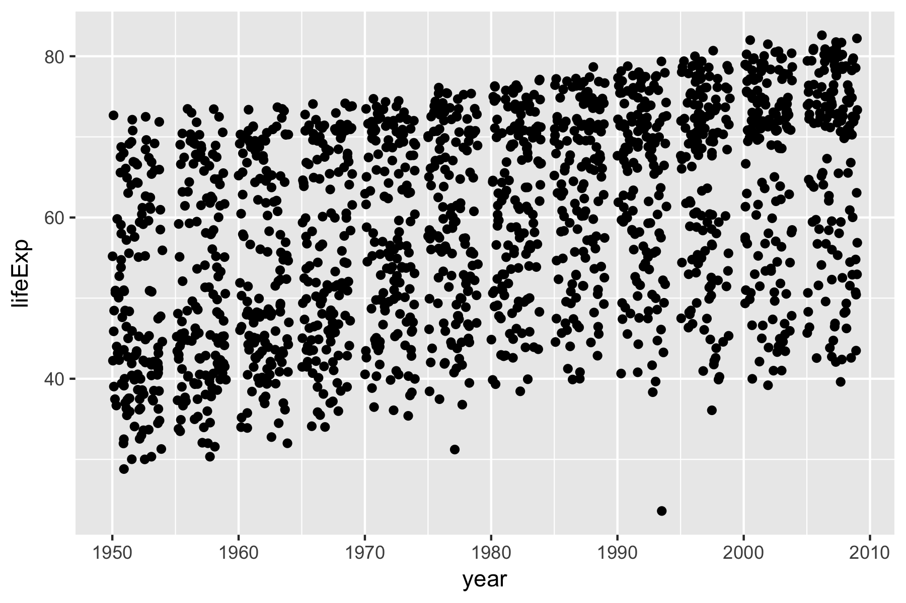
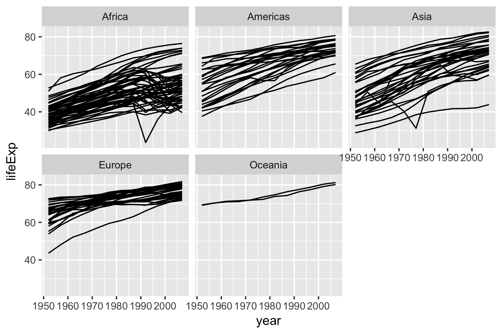
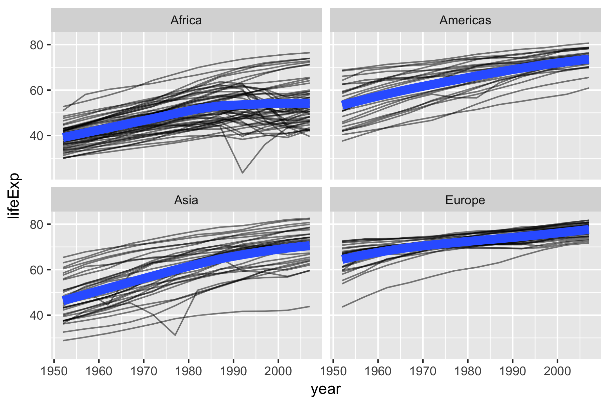
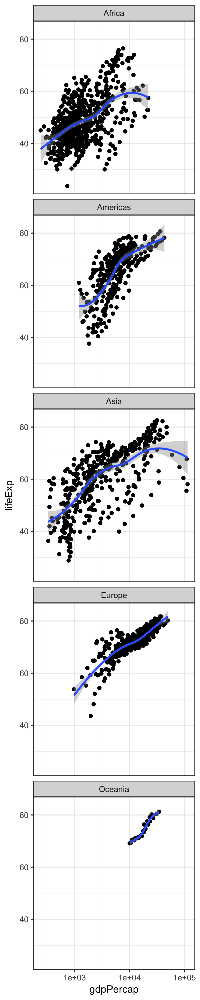

```{r setup, include=FALSE}
library(tidyverse)
library(gapminder)
```

Vimos que los datos de gapminder tienen para varios años la esperanza de vida y el producto interno bruto per cápita:


```{r}
glimpse(gapminder)
```


Podemos hacer una gráfica en la cuál se muestre el GDP per cápita vs la esperanza de vida:

```{r}
p <- ggplot(gapminder, aes(gdpPercap, lifeExp)) + scale_x_log10()
```


Vimos una gráfica en la cuál se mostraba una línea suavizada para cada continente. Veamos ahora la siguiente gráfica. 

```{r, message=FALSE, warning=FALSE}
p + geom_point(aes(color = continent)) + geom_smooth()
```

 ¿Cuál es la diferencia? ¿Por qué en esta gráfica solamente hay una línea suavizada y cómo modificarías _únicamente_ la última línea para obtener una gráfica como la que vimos antes?


 Haz una gráfica de dispersión de la esperanza de vida en el eje $y$ contra el año en el eje $x$. Completa el siguiente código para obtener una gráfica como la que se muestra a continuación.

```{r,eval=FALSE}
ggplot(gapminder, aes(x = <rellenar>, y = <rellenar>)) +
  geom_jitter()
```




 Haz una gráfica de pequeños múltiplos por continente pero ahora utilizando gráficas de línea. Completa el siguiente código para hacer una gráfica como la de abajo.


```{r, eval=FALSE}
ggplot(gapminder, aes(x = <rellenar>, y = <rellenar>, group = <rellenar>)) +
  geom_line() +
  facet_wrap(~<rellenar>)
```



 Agrega a al gráfica anterior una curva ajustada, smooth o lm. Investiga la ayuda de `geom_smooth()` para que el ajuste utilice el _método_ LOESS y con una línea gruesa (`lwd = 3`). La primera línea de código filtra los países que _no_ están en Oceanía, es decir, quita los países de Oceanía (es decir, `filter()` los datos donde `continent! = "Oceania"`).

```{r, eval = FALSE}
gapminder_2 <- filter(gapminder, continent != "Oceania")
ggplot(gapminder_2, aes(x = <rellenar>, y = <rellenar>, group = <rellenar>)) +
  geom_line(alpha = 1/2) +
  geom_smooth(aes(group = <rellenar>), <rellenar>) +
  facet_wrap(~<rellenar>)
```




 Haz una gráfica de pequeños múltiplos por continente donde se muestre un diagrama de dispersión de GDP per cápita en el eje $x$ y esperanza de vida en el eje $y$ y una curva suavizada con área sombreada de error estándar.

```{r, fig.height=15, fig.width=3, message=FALSE, warning=FALSE, eval=FALSE}
ggplot(gapminder, aes(x = <rellenar>, y = <rellenar>)) + 
  geom_point() +
  geom_smooth(aes(group = <rellenar>)) +
  facet_wrap(~<rellenar>, ncol = 1) +
  scale_x_log10() +
  theme_bw()
```

<div style="width:300px; height=200px">

</div>


