```{r setup, include=FALSE}
knitr::opts_chunk$set(cache = T, message = F, comment = NA, fig.align = "center")
```


<style>
  .espacio {
     margin-bottom: 1cm;
  }
</style>

# `#DataViz` con ggplot2 😁❤️

> "The simple graph has brought more information to the data analyst’s mind 
> than any other device." --- John Tukey

## El Cuarteto de Anscombe: ¿por qué es importante la visualización de datos?


En 1971 un estadístico llamado Frank Anscombe (fundador del departamento de Estadística de la Universidad de Yale) encontró cuatro conjuntos de datos (I, II, III y IV). Cada uno consiste de 11 observaciones y tienen las mismas propiedades estadísticas.

```{r, eval=FALSE}
anscombe
```


+------+-------+-------+-------+-------+-------+------+-------+
|$x_1$ |$y_1$  |$x_2$  |$y_2$  |$x_3$  |$y_3$  |$x_4$ |$y_4$  |
+======+=======+=======+=======+=======+=======+======+=======+
| 10.0 |  8.04 |  10.0 |  9.14 |  10.0 |  7.46 |  8.0 |  6.58 |
+------+-------+-------+-------+-------+-------+------+-------+
|  8.0 |  6.95 |  8.0  |  8.14 |  8.0  |  6.77 |  8.0 |  5.76 |
+------+-------+-------+-------+-------+-------+------+-------+
| 13.0 |  7.58 | 13.0  |  8.74 | 13.0  | 12.74 |  8.0 |  7.71 |
+------+-------+-------+-------+-------+-------+------+-------+
|  9.0 |  8.81 |  9.0  |  8.77 |  9.0  |  7.11 |  8.0 |  8.84 |
+------+-------+-------+-------+-------+-------+------+-------+
| 11.0 |  8.33 | 11.0  |  9.26 | 11.0  |  7.81 |  8.0 |  8.47 |
+------+-------+-------+-------+-------+-------+------+-------+
| 14.0 |  9.96 | 14.0  |  8.10 | 14.0  |  8.84 |  8.0 |  7.04 |
+------+-------+-------+-------+-------+-------+------+-------+
|  6.0 |  7.24 |  6.0  |  6.13 |  6.0  |  6.08 |  8.0 |  5.25 |
+------+-------+-------+-------+-------+-------+------+-------+
|  4.0 |  4.26 |  4.0  |  3.10 |  4.0  |  5.39 | 19.0 | 12.50 |
+------+-------+-------+-------+-------+-------+------+-------+
| 12.0 | 10.84 | 12.0  |  9.13 | 12.0  |  8.15 |  8.0 |  5.56 |
+------+-------+-------+-------+-------+-------+------+-------+
|  7.0 |  4.82 |  7.0  |  7.26 |  7.0  |  6.42 |  8.0 |  7.91 |
+------+-------+-------+-------+-------+-------+------+-------+
|  5.0 |  5.68 |  5.0  |  4.74 |  5.0  |  5.73 |  8.0 |  6.89 |
+------+-------+-------+-------+-------+-------+------+-------+

Por ejemplo, todos los conjuntos de datos I, II, III, y IV, tienen exactamente misma media de $x$, $\bar{x}_i = \bar{x}_j$, y misma media de $y$, $\bar{y}_i = \bar{y}_j$ para toda $i,j=1,2,3,4$. Además, se puede ver que todos tienen misma varianza muestral de $x$ y de $y$. En cada conjunto de datos la correlación entre $x$ y $y$ es la misma, y por consiguiente, los coeficientes de la regresión lineal $\beta_0$ y $\beta_1$ también son iguales. 

+-----------------------------+-------------------+
|Propiedad                    |Valor              |
+=============================+===================+
|Media de $x$                 |9                  |
+-----------------------------+-------------------+
|Varianza muestral de $x$     |11                 |
+-----------------------------+-------------------+
|Media de $y$                 |7.50               |
+-----------------------------+-------------------+
|Varianza muestral de $y$     |4.12               |
+-----------------------------+-------------------+
|Correlación entre $x$ y $y$  |0.816              |
+-----------------------------+-------------------+
|Línea de regresión lineal    |$y = 3.00 + 0.500x$|
+-----------------------------+-------------------+

¿En qué son diferentes estos conjuntos de datos? ¿Es posible con la información anterior concluir que los cuatro conjuntos de datos deben ser similares? ¿Que tengan estadísticas similares asegura que provienen de un mismo modelo?


Cuando analizamos los datos de manera gráfica en un histograma encontramos rápidamente que los conjuntos de datos son muy distintos.

<div style="text-align: center;">**“Una imagen dice más que mil palabras.”**</div>
<center>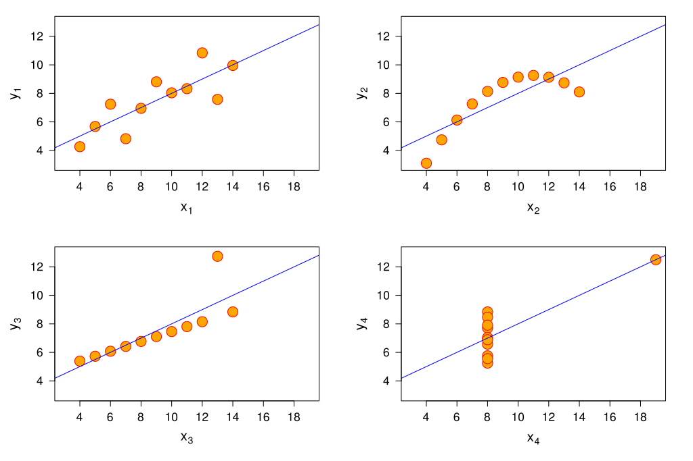</center>
<p class="espacio">
</p>

En la gráfica del primer conjunto de datos, se ven datos como los que se tendrían en una relación lineal simple con un modelo que cumple los supuestos de normalidad. La segunda gráfica (la de arriba a la derecha) muestra unos datos que tienen una asociación pero definitivamente no es lineal y el coeficiente de correlación no es relevante en este caso. En la tercera gráfica (abajo a la izquierda) están puntos alineados perfectamente en una línea recta, excepto por uno de ellos. En la última gráfica podemos ver un ejemplo en el cual basta tener una observación atípica para que se produzca un coeficiente de correlación alto aún cuando en realidad no existe una asociación lineal entre las dos variables.  

Edward Tufte usó el cuarteto en la primera página del primer capítulo de su libro The Visual Display of Quantitative Information, para enfatizar la importancia de mirar los datos antes de analizarlos. [1]

El cuarteto de Anscombe es un ejemplo extremo y que fue construido deliberadamente para demostrar esta idea. Sin embargo, los beneficios de visualizar datos pueden mostrarse en casos reales. Abajo se muestra una gráfica de Jackman (1980) que aparece en un artículo corto como comentario a Hewitt (1977). En su paper original, Hewitt afirma que existen una asociación significativa entre el porcentaje de votantes y la desigualdad por ingreso utilizando un análisis de regresión líneal con datos de 18 países. Una prueba de validación cruzada sencilla hubiera detectado el problema, pero la ayuda visual díficilmente se puede refutar.

<center></center>
<p class="espacio">
</p>

Un ejemplo menos extremo es el de Jan Vanhove [9] que descubrió una manera de generar un arreglo numérico (variable $y$) que tenga una correlación fija $\rho$ dado otro arreglo númerico (variable $x$). Con esto pudo construir una gráfica como la que se muestra a continuación. 


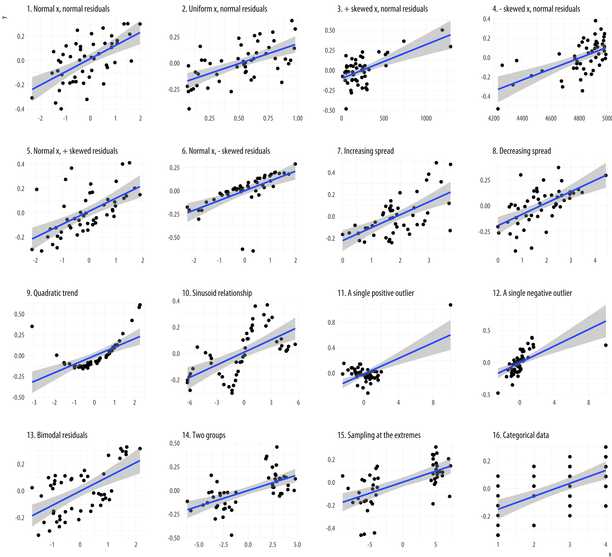

En la gráfica se muestran puntos de datos generados aleatoriamente. En cada panel los puntos tienen una correlación de $0.5$. Se puede ver la regla con la cual fueron producidos los puntos en cada panel. Por ejemplo, en el primer panel la variable $x$ es una muestra de una distribución normal y la variable $y$ fue construida de tal forma que la correlación entre $x$ y $y$ es $0.5$ y los residuales de la regresión también cumplen el supuesto de normalidad. Sin embargo, no todos los casos son iguales. Y en el último caso, el número 16 en el que la variable $x$ es categórica, claramente no hay ningún tipo de asociación entre las variables que se muestran en la gráfica.

Podemos concluir, por lo tanto, que una visualización es importante. Una gráfica puede resultar útil para ver lo datos. Los datos reales generalmente vienen sucios, y consecuentemente, presentarlos gráficamente conllevan una dificultad inherente. Ha habido un enorme debate sobre qué tipo de gráfica es más efectiva, cuándo una visualización deja de ser útil y pasa a ser superflua, e incluso cuándo en ocasiones puede ser engañosa tanto para los investigadores como para cualquier tipo de audiencia por igual. 


Aún a pesar del cuarteto de Anscombe, y en especial para grandes volúmenes de datos, tanto los resúmenes numéricos como las gráficas nos sirven como una herramienta para hacer simplificaciones  **deliberadamente**, para poder ver más allá de una nube de puntos. Pero no siempre vamos a encontrar todas las respuestas únicamente _viendo_. [3]

## ¿Por qué es importante que la visualización sea correcta?


<p class="espacio">
</p>
<p class="espacio">
</p>

<div style="text-align: center;">**“There are three kinds of lies: lies, damned lies, and statistics.”**</div>

<div style="text-align: center;">
*Mark Twain*

</div>

<center></center>
<p class="espacio">
</p>

En su libro The Visual Display of Quantitative Information (1983), Edward R. Tufte logra extraer una serie de principios generales (o reglas de dedo) a partir de una serie de ejemplos de buenas y malas visualizaciones. El mensaje de Tufte aunque es frustrante es consistente:

> Una gráfica excelente gráfica presenta datos interesantes de forma bien diseñada: es una cuestión de fondo, de diseño, y estadística... [Se] compone de ideas complejas comunicadas con claridad, precisión y eficiencia. ... [Es] lo que da al espectador la mayor cantidad de ideas, en el menor tiempo, con la menor cantidad de tinta, y en el espacio más pequeño. ... Es casi siempre multivariado. ... Una excelente gráfica debe decir la verdad acerca de los datos. (Tufte, 1983)

Tufte ilustra el punto con la famosa visualización de Charles Joseph Minard de la marcha de Napoleón sobre Moscú, que se muestra aquí en la Figura 2.5. Señala que esta imagen "bien podría ser el mejor gráfico estadístico jamás dibujado", y sostiene que "cuenta una historia rica y coherente con sus datos multivariados, mucho más esclarecedora que un solo número que rebota en el tiempo". Se representan seis variables: el tamaño del ejército, su ubicación en una superficie bidimensional, la dirección del movimiento del ejército y la temperatura en varias fechas durante la retirada de Moscú ".

Tufte utiliza como ejemplo una visualización famosa de 1869 de Charles Joseph Minard, un ingeniero francés que trabajaba en Bordeaux. 


Hoy en día Minard es reconocido como uno de los principales contribuyentes a la teoría de análisis de datos y creación de **infografías** con un fundamento estadístico.


En primer instancia, la gráfica es impresionante por su representación en dos dimensiones de seis tipos de datos:

- el número de tropas de Napoleón

- la distancia

- la temperatura

- la latitud y la longitud

- la dirección en que viajaban las tropas

- y la localización relativa a fechas específicas.


El portafolio original de Minard *Tableaux Graphiques et Cartes Figuaratives de M. Minard* se encuentra actualmente en la Bibliothèque de l'École Nationale des Ponts et Chaussées, París.

Podemos pensar en lo lejano que está la gráfica de Minard de la mayoría de las gráficas estadísticas que se hacen hoy en día. Actualmente, las gráficas tienden a ser aplicaciones o generalizaciones de las gráficas de dispersión y las gráficas de barras con el objetivo de graficar los datos crudos o de ver el resultado de un modelo. Mientras que la visualización de Minard busca aumentar el volumen de datos visibles, el número de variables que se muestran dentro de un panel, o el número de páneles que se muestran en la gráfica, nuestras visualizaciones de hoy en día buscan formas de ver los resultados, de estimaciones puntuales, intervalos de confianza o los "pronósticos" de manera fácil y comprensible. 
Finalmente, Tufte concluye que un __"tour de force"__ como el de Minard "puede ser descrito y admirado, pero no existe una seire de principios compositivos sobre cómo crear esta gráfica única y maravillosa gráfica". Lo más que se puede hacer para obtener una guía "rutinaria, de diseños de uso diario" es sugerir algunas pautas como "tener un formato y diseño adecuado" para nuestras gráficas del día a día, "usar palabras, números y dibujos simultáneamente", "mostrar una complejidad de detalle accesible", y "evitar la decoración sin contenido, es decir, el __chartjunk__" (Tufte 1983, 177).

A continuación vamos a mostrar una serie de principios que ilustran cómo mejorar la utilidad (y la veracidad 😅) de una gráfica.

### Eje $y$ truncado

A mediados de diciembre del 2015, la Casa Blanca tweeteó: "Buenas noticias: la tasa de graduados en las escuelas de secundaria de Estados Unidos ha aumentado a un máximo histórico". El tweet incluía una gráfica.


Esto tiene varios problemas. En primer lugar, nunca es una buena idea ilustrar elementos de una gráfica. ¿Qué significa que cinco libros equivalen al 75%, o que 16 libros equivalen al 82%? Pero, en última instancia, ésta es una gráfica de barras, y las gráficas de barras siempre deben comenzar el eje vertical en cero. Aquí están los mismos datos en una escala apropiada:

```{r, echo=FALSE, message=FALSE, warning=FALSE}
library(tidyverse)
obama <- tibble(Year = 2008:2014, `Graduation rate` = c(0.75,0.75,0.78,0.79,0.80,0.81,0.82))
ggplot(obama, aes(x=Year, y = `Graduation rate`)) +
  geom_bar(stat="identity") +
  scale_x_continuous(breaks = 2008:2014)
```

¡No se obtienen resultados tan dramáticos con esta nueva gráfica! 🙃 Pero los problemas no terminan con esta tabla. Supuestamente los datos de estas tasas de graduación provienen del Departamento de Educación de Estados Unidos (NCES). Sin embargo, estos datos no se encuentran en ninguna fuente de datos pública. Entonces, ¿la Casa Blanca sacó estas tasas de graduación de múltiples conjuntos de datos? Fuentes distintas pueden medir las tasas de graduación de diferentes maneras, lo que sería problemático. 💩 Probablemente la administración de Obama tenía acceso a fuentes de datos que no están disponibles públicamente. 

Aquí hay otros ejemplos en los que se ha cometido este mismo error en los medios:

<center></center>
<p class="espacio">
</p>

<center></center>
<p class="espacio">
</p>

### Gráfica acumulada

Muchas personas optan por crear gráficas acumuladas de cosas como cantidad de usuarios, ingresos, descargas u otras métricas importantes. Por ejemplo, en lugar de mostrar una gráfica del número de iPhones vendidos trimestralmente, Tim Cook elegió mostrar un total acumulado del número de iPhones vendidos hasta la fecha.


<p class="espacio">
</p>

En el mejor de los casos, la gráfica es engañosa; en el peor, es falsa. Esta gráfica no tiene escala. El número de iPhones vendidos podría estar en miles de millones o en cientos. Más aún, mostrar las ventas acumulativas tácitamente exagera la cantidad de usuarios de iPhone, ya que podemos suponer que una parte considerable de las compras del iPhone son para reemplazar otros iPhones viejos o rotos. 

<p class="espacio">
</p>
Usando datos de los informes trimestrales  de Apple presentados ante la Comisión de Bolsa y Valores, Yanofsky (2013) hizo la siguiente gráfica:

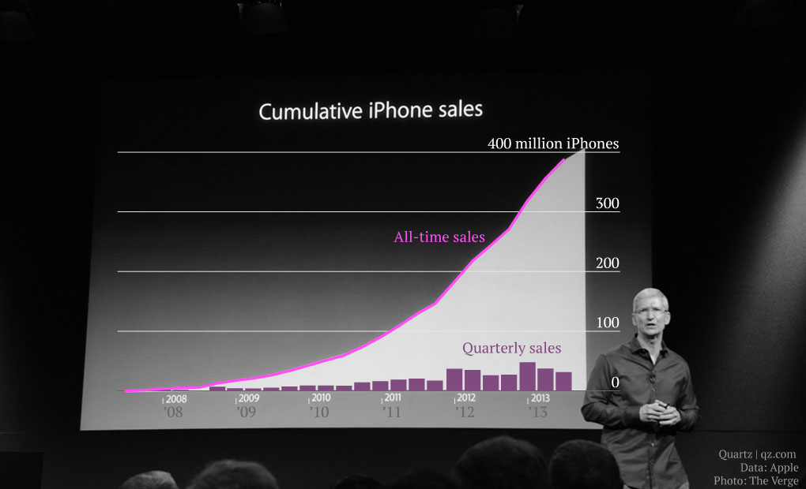
<p class="espacio">
</p>

Si analizamos la gráfica acumulada, es posible ver que la pendiente está aumentando o disminuyendo a medida que pasa el tiempo, lo que indica una disminución en la venta del iPhone en los últimos 3 trimestres. Sin embargo, no es inmediatamente obvio, y la gráfica es increíblemente engañosa.

### Ignorar convenciones

Cuando se ignoran las prácticas estándar se puede llegar a construir visualizaciones de datos engañosas. Estamos acostumbrados, por ejemplo, a que las gráficas de pie representan partes de un todo, o que los tiempos avanzan de izquierda a derecha. Entonces, cuando esas reglas son violadas, nos es difícil ver lo que está sucediendo realmente. 

Aquí hay un ejemplo de una gráfica de pie que presentó Fox durante las primarias presidenciales del 2012:
<center></center>
<p class="espacio">
</p>


Las tres partes del pie no suman 100%. La encuesta presumiblemente permitió respuestas múltiples, en cuyo caso una gráfica de barras hubiera sido más apropiada. En cambio, esta gráfica de pie nos da  la impresión de que cada uno de los tres candidatos tuvo aproximadamente un tercio del apoyo, lo cual no es cierto.

Otro ejemplo es esta visualización publicada por Business Insider, que parece mostrar lo contrario de lo que realmente está sucediendo:

<center></center>
<p class="espacio">
</p>


A primera vista, parece que las muertes por arma de fuego están disminuyendo en Florida. Pero analizando la gráfica más a fondo podemos ver que el eje vertical (el eje $y$) está al revés, con cero en la parte superior y el valor máximo en la parte inferior. A medida que aumentan las muertes por armas de fuego, la línea se inclina hacia abajo, violando una convención bien establecida de que los valores y aumentan a medida que avanzamos hacia arriba de la gráfica.

De todo esto podemos llegar a una conclusión sencilla: debemos tener cuidado al diseñar visualizaciones y al interpretar las gráficas creadas por otros.

### Datos _cuchareados_

Después de un tiroteo en San Bernardino, California, hubo mucha discusión sobre qué casos considerar como tiroteos masivos. Existen muchas fuentes de datos pero el problema es que todas consideran distintos criterios. Algunos solamente cuentan incidentes en los cuales cuatro o más personas fueron asesinadas.

El 2 de diciembre de 2015, un sitio web llamado Truthstream Media publicó una historia titulada "¿Por qué ha habido más tiroteos masivos bajo el presidente Obama que bajo los cuatro presidentes anteriores juntos?" Incluía la siguiente gráfica, que según se basó en tres fuentes de datos. Una era la base de datos Mother Jones de tiroteos masivos, que usa los criterios de cuatro asesinados o más. Las otras dos eran de Wikipedia.

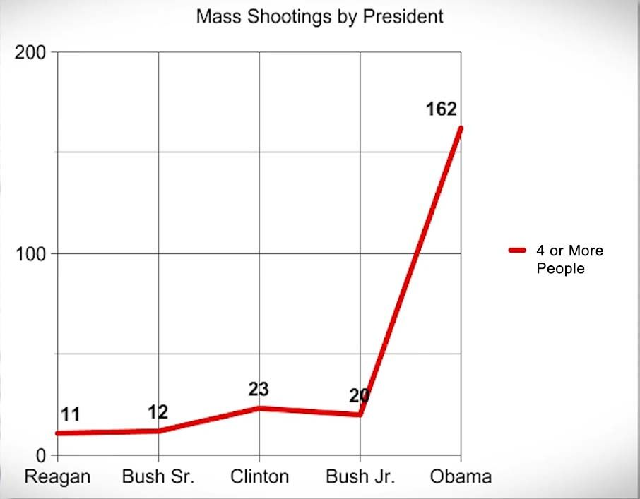

<p class="espacio">
</p>

Después de una revisar las fuentes de datos utilizadas, encontraron que el sitio web había cuchareado los datos considerando casos de asesinatos domésticos bajo la administración de Obama, pero excluyendo casos similares que ocurrieron durante el periodo de sus predecesores. Utilizando únicamente los datos de Mother Jones podemos construir la siguiente gráfica:

```{r, message=FALSE, warning=FALSE, echo=FALSE}
shootings <- read_csv(file = 'datos/Mother_Jones_Mass_Shootings.csv')
presidents <- tibble(Year = c(1982:1989, 1990:1993, 1994:2001, 2002:2009, 2010:2017),
                     President = c(rep("Ronald Reagan", 8),
                                   rep("George H. W. Bush", 4),
                                   rep("Bill Clinton", 8),
                                   rep("George W. Bush", 8),
                                   rep("Barack Obama", 8)))
presidents$President <- ordered(presidents$President, levels=unique(presidents$President))
sh_pr <- shootings %>% 
  left_join(presidents, by = "Year") %>%
  filter(Fatalities >= 4 & Type == "Mass")
ggplot(sh_pr, aes(x=President, y=..count..)) +
  geom_bar() +
  coord_flip()
```

Utilizando únicamente una fuente de datos, las conclusiones no son tan exorbitantes.

### Eje $y$ sesgado

En una audiencia celebrada el 29 de septiembre, los republicanos en el Congreso de los Estados Unidos interrogaron a la presidenta de Planned Parenthood, Cecile Richards, acusándola de hacer un uso indebido de los $500 millones en fondos federales anuales de la organización. Para aclarar el punto, el representante Jason Chaffetz de Utah mostró esta gráfica:

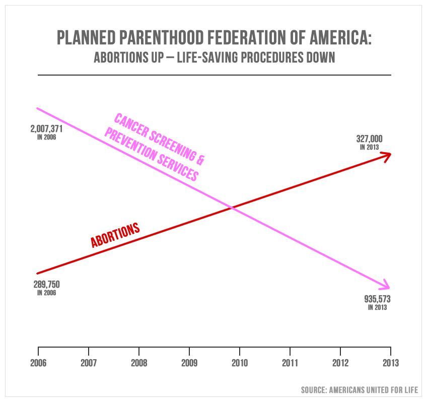

<p class="espacio">
</p>

Y así es como el congresista explicó la tabla: "En rosa, se ve la reducción en los exámenes de cáncer y servicios de prevención, y en rojo se muestra el aumento en los abortos. Eso es lo que está sucediendo en su organización".

A primera vista, puede parecer que el número de abortos realizados por Planned Parenthood se ha disparado, mientras que el número de exámenes de detección de cáncer se ha desplomado. Uno también podría quedar con la impresión de que la organización ha estado realizando más abortos que procedimientos preventivos desde 2010. Pero ese no es el caso. El problema principal con esta gráfica es que no tiene un eje $y$ discernible, por lo que la ubicación de las líneas es arbitraria. Creer esta gráfica tal como se presenta es equivalente a creer que 327,000 es un número mayor que 935,573.

Con la guía de los expertos, en PolitiFact [10] compilaron la cantidad de abortos y servicios de detección/prevención del cáncer de los informes anuales de Planned Parenthood de 2006 a 2013 (no pudieron encontrar el informe correspondiente a 2008). Así es como se debería ver la gráfica:

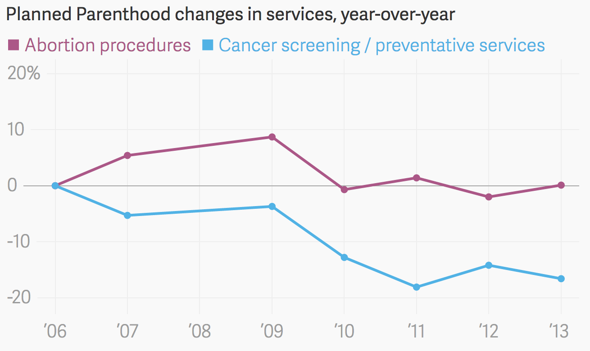

<p class="espacio">
</p>

La cantidad de pruebas de detección de cáncer y servicios preventivos disminuyó, eso era cierto. Sin embargo, la tasa de cambio del número de abortos realizados se mantuvo constante.

Como último ejemplo, tenemos esta gráfica que apareció en un tweet:

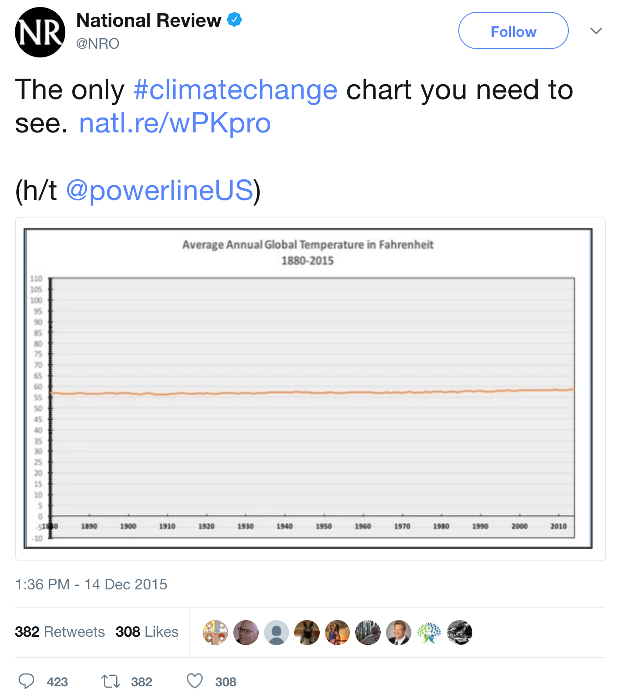

<p class="espacio">
</p>

Ésta es la gráfica en la cual debemos pensar cuando alguien asegura que el eje $y$ siempre debe comenzar en cero. Un cambio de incluso un grado en la temperatura global promedio es significativo, pero el hecho de que el eje comience en cero lo hace ver minúsculo. 

Bussiness week hizo esta comparación con la gráfica anterior:

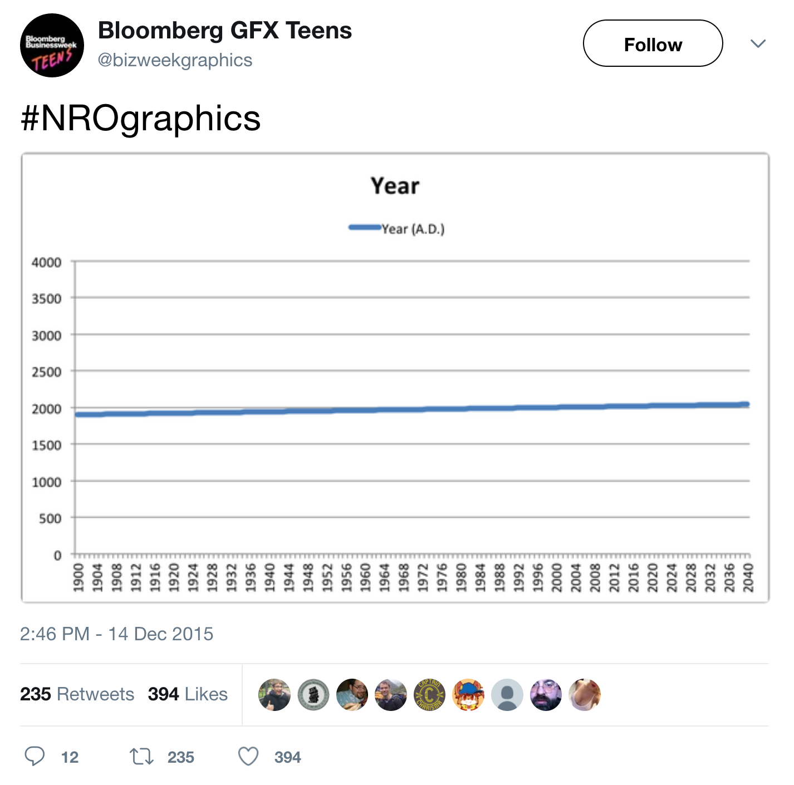

<p class="espacio">
</p>

Podemos repetir la gráfica utilizando datos de la NASA en una escala más apropiada:

```{r, echo=FALSE, message=FALSE, warning=FALSE}
# https://data.giss.nasa.gov/gistemp/tabledata_v3/GLB.Ts+dSST.txt
temp <- read_csv("datos/nasa_temperatures.csv")
ggplot(temp, aes(x=Year, y=`J-D`)) +
  geom_line() +
  scale_y_continuous(name="Change in average temperature in degrees Celsius")
```


## Principios para hacer que una visualización sea efectiva

Consideremos la siguiente gráfica sobre esperanza de vida en el 2007:

<center></center>
<p class="espacio">
</p>


Podemos analizar otras dos formas de visualizar estos datos de la esperanza de vida por continente. Una diferencia entre ambas gráficas es la escala: la gráfica de barras comienza en cero y la longitud de cada barra representa el valor de la variable "esperanza de vida promedio en 2007" para cada continente. Por otro lado, el panel de la derecha es un diagrama de puntos de Cleveland. Cada observación está representada por un punto, y la escala está restringida al rango de los datos como se muesgtra.

```{r, echo=FALSE, fig.width=12, message=FALSE, warning=FALSE, fig.align='center'}
library(png)
library(grid)
library(gridExtra)
img1 <-  rasterGrob(as.raster(readPNG("figuras/02-bar-simple-1.png")), interpolate = FALSE)
img2 <-  rasterGrob(as.raster(readPNG("figuras/02-bar-simple-2.png")), interpolate = FALSE)
grid.arrange(img1, img2, ncol = 2)
```

¿Cuál es el preferido? Es difícil dar una respuesta inequívoca. Todo depende de qué tan seguido se use un tipo de gráfica más que la otra para engañar a los demás. Sin embargo, en este caso tal vez utilizar una gráfica de barras para representar una media (en específico la esperanza de vida) no sea la mejor idea.


### Tipos de variables

- cuantitativas o de intervalo
    
    &nbsp;&nbsp;&nbsp;&nbsp;altura, peso, edad, ingreso

- ordinal

    &nbsp;&nbsp;&nbsp;&nbsp;nivel educativo

- nominal

    &nbsp;&nbsp;&nbsp;&nbsp;ciudad, código postal, raza, género

### Geometrías que se pueden utilizar

<div style="text-align: center;">**¿Qué geometrías puedo usar?**</div>
<center>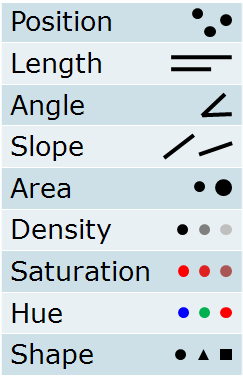</center>
<p class="espacio">
</p>

### The _Grammar of Graphics_ de Leland Wilkinson

Una ventaje de ggplot es que implementa una gramática de gráficas de forma organizada y con sentido orientada a esta forma de asociar variables con geometrías (Wilkinson 2005). En lugar de tener una lista enorme y conceptualmente plana de opciones para hacer gráficas, ggplot parte en varios pasos el procedimiento para realizar una gráfica:

1. primero, se debe proporcionar información a la función sobre qué datos y qué variables se van a utilizar.

2. segundo, se debe vincular las variables que se van a utilizar en la gráfica con las características específicas que se requiere tener en la gráfica.

3. tercero, se debe elegir una función `geom_` para indicar qué tipo de gráfica se dibujará, un diagrama de dispersión, una gráfica de barras o un diagrama de caja.


En general, según Leland Wilkinson, hay dos principios generales que se deben seguir:

- La geometría utilizada debe coincidir con los datos que se están visualizando.

- La geometría utilizada debe ser fácil de interpretar.


### Codificación para cada tipo de variable

Cleveland y otros investigadores han estudiado qué geometrías son más adecuadas para cada tipo de variable y qué geometrías facilitan una percepción correcta de los datos para cada tipo de variable.

<div style="text-align: center;">**¿Qué geometrías son más adecuadas para cada tipo de variable?**</div>
<center>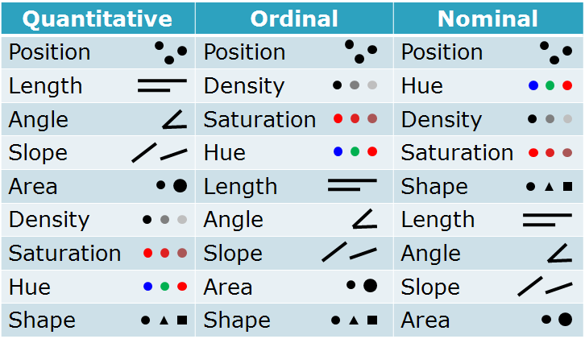</center>
<p class="espacio">
</p>

### Percepción de escala


Entre la percepción visual y la interpretación de una gráfica están implícitas tareas visuales específicas que las personas debemos realizar para ver correctamente la gráfica. En la década de los ochenta, William S. Cleveland y Robert McGill realizaron algunos experimentos identificando y clasificando estas tareas para diferentes tipos de gráficos [23, 24]. Generalmente se le pregunta a la persona que compare _dos_ valores dentro de una gráfica, por ejemplo, dos barras en una gráfica de barras, o dos rebanadas de una gráfica de pie.


<p class="espacio">
</p>

Para cada tipo de gráfica, se pidió a los sujetos que identificaran el segmento o la parte más pequeña de las dos marcadas en la gráfica, y luego que "hicieran un juicio visual rápido", estimando qué porcentaje era el más pequeño del más grande. Los tipos 1-3 usan una codificación de posición a lo largo de una escala común, mientras que los tipos 4 y 5 usan una codificación de longitud. La gráfica de pie codifica los valores como ángulos, la gráfica de burbujas y las rectangulares las codifican como áreas circulares o áreas rectangulares. 

Los resultados de Cleveland y McGill fueron replicados por Heer y Bostock en 2010 y los resultados se muestran a continuación:

<center></center>
<p class="espacio">
</p>


El patrón general es claro, la percepción correcta de una gráfica empeora conforma nos alejamos de hacer comparaciones en una escala común a hacer comparaciones basadas en longitudes, hasta ángulos y finalmente áreas. Las comparaciones de áreas tienen resultados particularmente malos, incluso peores que los de la difamada (merecidamente) gráfica de pie.


<p class="espacio">
</p>

<div style="text-align: center;">**Dejemos los pie's para el postre**</div>
<center></center>
<p class="espacio">
</p>

Para ilustrar la dificultad al interpretar las gráficas de pie, consideremos la siguiente gráfica de pie con seis rebanadas. Observemos que en este caso es fácil determinar que la porción de la Compañía C (parte verde) es del 25%, exactamente una cuarta parte del pastel.

<p class="espacio">
</p>

<center>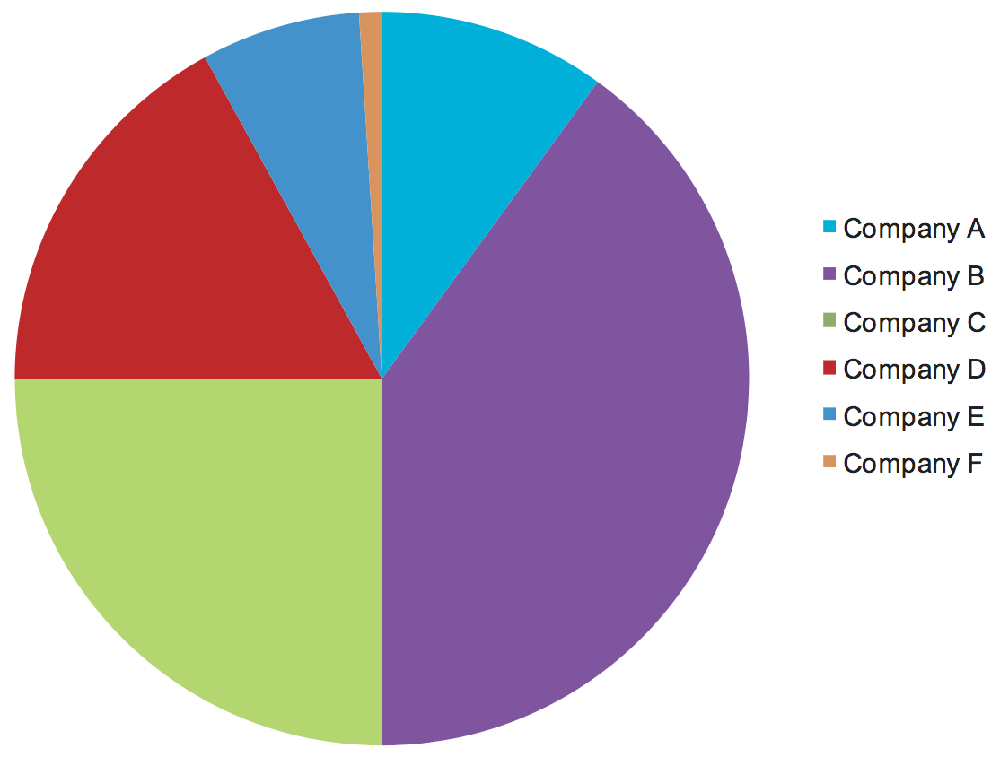</center>
<p class="espacio">
</p>


Notemos ahora que si rotamos el pie, hasta la rebanada verde del 25% ya no es tan fácil de reconocer como tal.

<p class="espacio">
</p>

<center>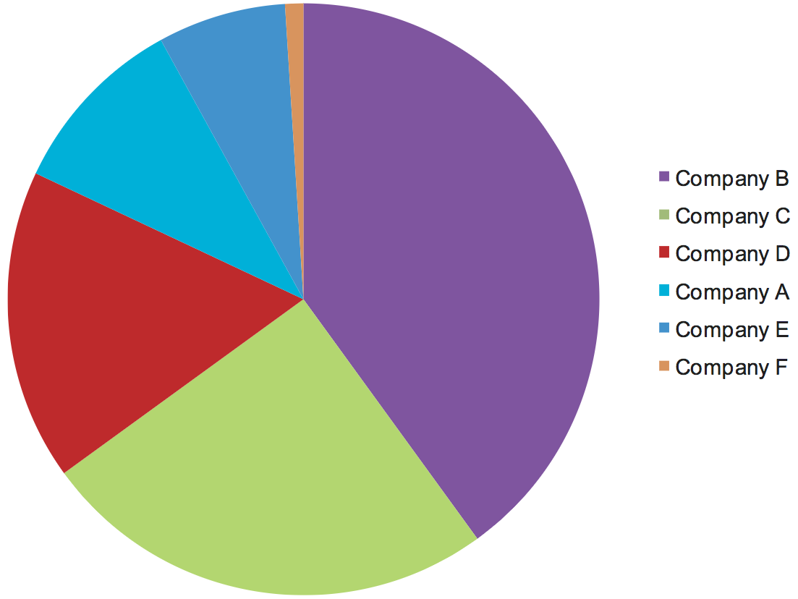</center>
<p class="espacio">
</p>

Podemos argumentar que el problema se resuelve poniendo etiquetas en cada rebanada para indicar el porcentaje que representa.

<p class="espacio">
</p>

<center>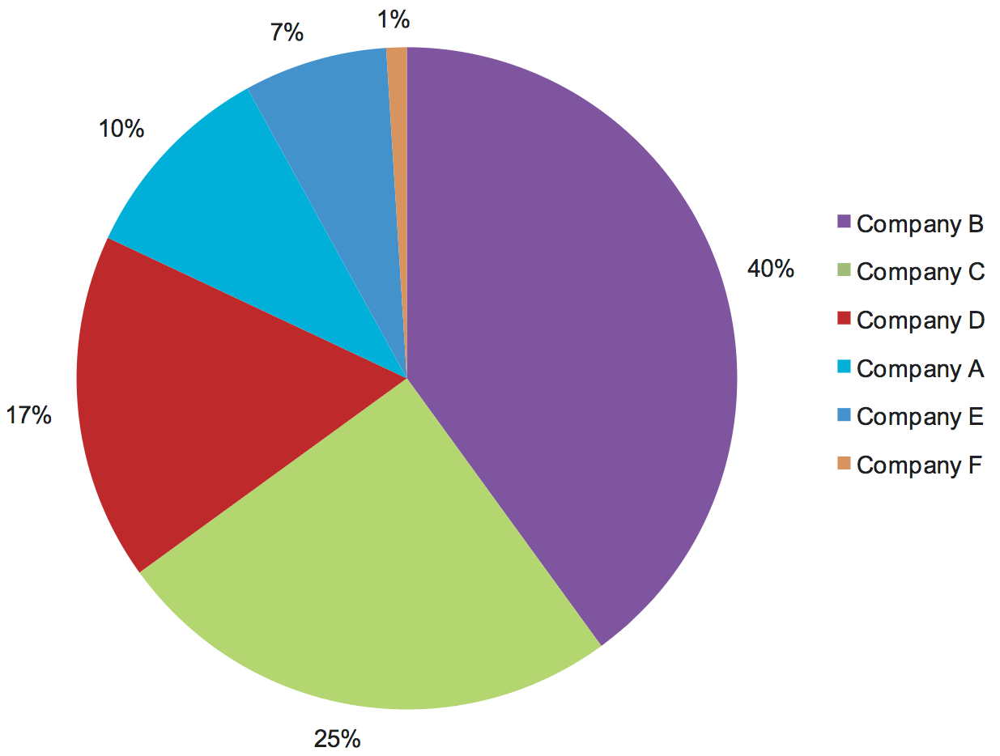</center>
<p class="espacio">
</p>

Pero para el caso sería mejor agregar a las etiquetas el nombre correspondiente a cada rebanada para evitar tener que mover los ojos entre el pie y la leyenda de la gráfica.

<p class="espacio">
</p>

<center>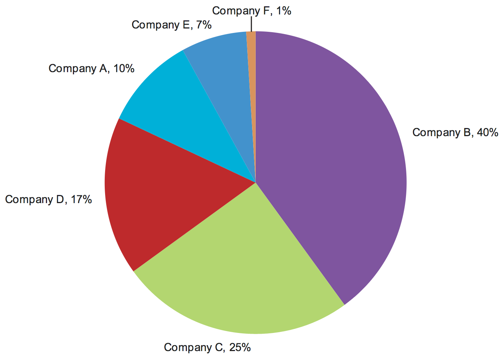</center>
<p class="espacio">
</p>

Esto resulta en un absurdo, ya que la gráfica no está aportando ninguna ventaja con respecto a ver los porcentajes en una tabla o en una gráfica de barras.

<p class="espacio">
</p>

<center>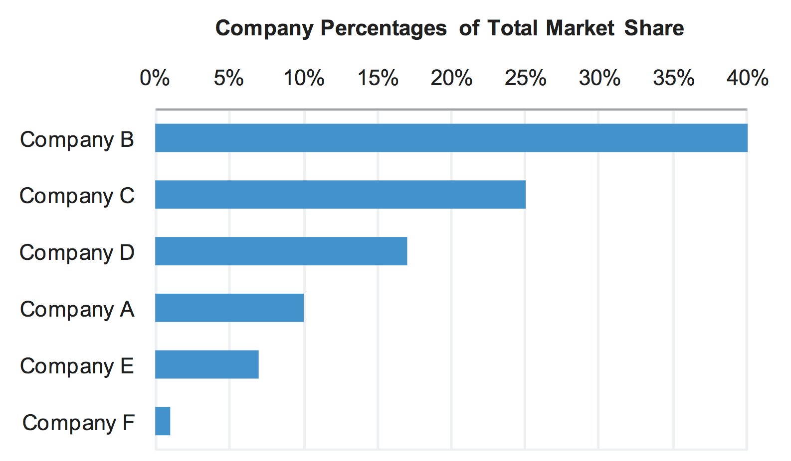</center>
<p class="espacio">
</p>

Si decimos que el círculo pequeño tiene área de _una_ unidad y nos preguntamos cuál es el área del círculo grande, ¡vamos a sudar la gota gorda! Generalmente el valor que las personas le asignan al área del círculo grande está en el rango de 4 a 60, cuando en realidad el área es de 16.


<center>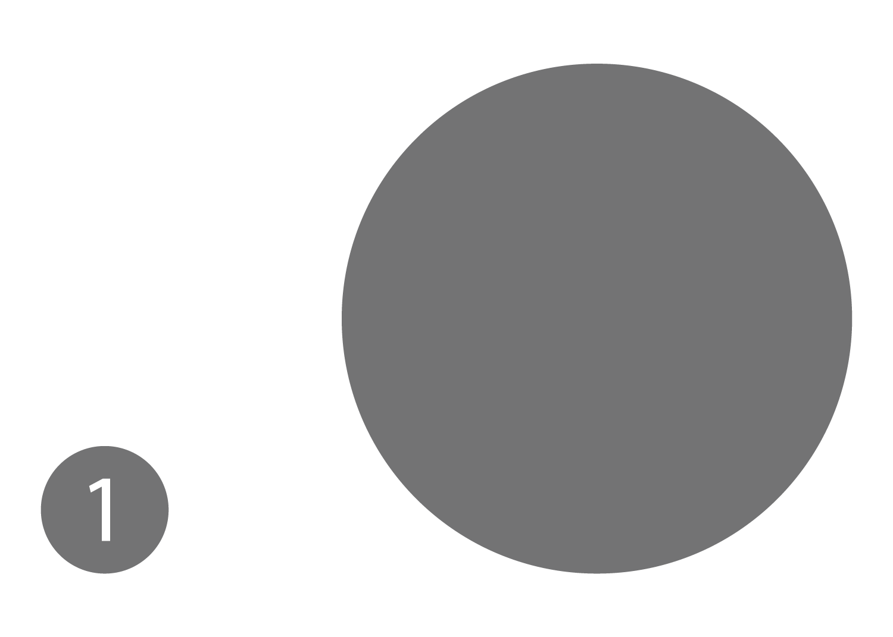</center>
<p class="espacio">
</p>


En la siguiente imagen podemos analizar la relación entre la correcta percepción de una gráfica y las distintas formas de codificar las cantidades que se están representando.

<center>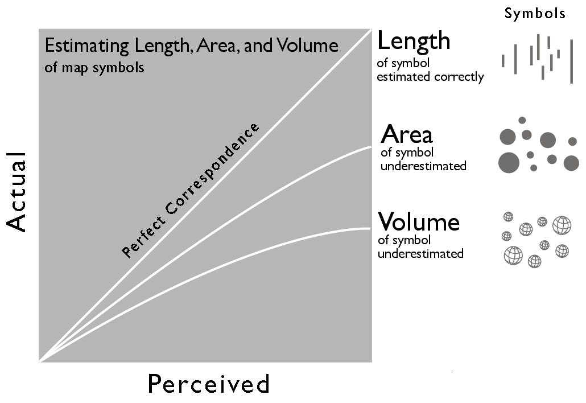</center>
<p class="espacio">
</p>

Un aspecto importante que debemos hacer notar es que nuestros ojos mienten. 


<p class="espacio">
</p>

Y si queremos utilizar el área para codificar nuestros datos, entonces debemos asegurarnos de hacerlo correctamente y no utilizar el ancho o la altura para representar áreas de objetos que ultimadamente no tendrán ningún sentido.

<div style="text-align: center;">**¡Hasta la Casa Blanca lo tuvo mal!**</div>
<center></center>
<p class="espacio">
</p>


<p class="espacio">
</p>

## La trifecta de una gráfica

La trifecta de una gráfica (definida por Fung en 2015) es un marco general para la crítica de visualización de datos. El objetivo es tratar de dar un conjunto de "reglas generales" para una crítica de visualización de datos.


<div style="text-align: center;">**La trifecta de una gráfica**</div>
<center></center>
<p class="espacio">
</p>

Una gráfica siempre debe tener una pregunta (Q), que aparece en la parte superior de la trifecta porque cualquier visualización debe tener un _objetivo_. Debe estar bien planteada y ser interesante. Un buen planteamiento se dirige a la búsqueda de los datos apropiados para hacer la gráfica. Una pregunta interesante asegura una audiencia comprometida.

En segundo lugar están lo datos (D). Los datos deben ser relevantes para responder la pregunta que se está abordando. La relevancia a menudo puede aumentar si se reduce el ruido en los datos, si los datos tienen menos errores o transformaciones.

Por último, los elementos visuales (V) deben presentar los datos de una manera clara y concisa, abordando la pregunta directamente.

### ggplot

Vamos a ver cómo visualizar los datos usando ggplot2. R tiene varios sistemas para hacer gráficas, pero ggplot2 es uno de los más elegantes y versátiles. ggplot2 implementa la __gramática de gráficas__,  un sistema consistente para describir y construir gráficas. Con ggplot2, pueden hacerse cosas más rápido, aprendiendo un único sistema consistente, y aplicándolo de muchas formas.

Para mayor información sobre los fundamentos teóricos de ggplot2 se recomienda leer el artículo titulado "The Layered Grammar of Graphics", visitando la siguiente liga: <http://vita.had.co.nz/papers/layered-grammar.pdf>.

Lo más importante para entender ggplot es comprender la estructura y la lógica para hacer una gráfica. El código debe decir cuáles son las conexiones entre las variables en los datos y los elementos de la gráfica tal como los vamos a ver en la pantalla, los puntos, los colores y las formas. En ggplot, estas conexiones lógicas entre los datos y los elementos de la gráfica se denominan *asignaciones estéticas* o simplemente *estéticas*. Se comienza una gráfica indicando a ggplot cuáles son los datos, qué variables en los datos se van a usar y luego cómo las variables en estos datos se mapean lógicamente en la estética de la gráfica. Luego, toma el resultado y se indica qué tipo de gráfica se desea, por ejemplo, un diagrama de dispersión, una gráfica de barras, o una gráfica de línea. En ggplot este tipo general de gráficas se llama `geom`. Cada *geom* tiene una función que lo crea. Por ejemplo, `geom_point()` hace diagramas de dispersión, `geom_bar()` hace gráficas de barras, `geom_line()` hace gráficas de línea, y así sucesivamente. Para combinar estas dos piezas, el objeto `ggplot()` y el `geom` se suman literalmente en una expresión, utilizando el símbolo "`+`".
 
<div style="text-align: center;">**¿Qué geometrías son más adecuadas para cada tipo de variable?**</div>
<center></center>
<p class="espacio">
</p>


Usaremos los datos de `gapminder` para hacer nuestras primeras gráficas. Vamos a asegurarnos de que la biblioteca que contiene los datos esté cargada:


```{r, message=FALSE, warning=FALSE}
library(gapminder)
```

Esto hace que una tabla de datos esté disponible para su uso. Para ver un pedazo de la tabla utilizamos la función `glimpse()`:

```{r}
glimpse(gapminder)
```


Supongamos que queremos graficar la esperanza de vida vs el PIB per cápita para todos los años y países en los datos. Haremos esto creando un objeto que contenga parte de la información necesario y a partir de ahí vamos a construir nuestra gráfica. Primero debemos indicarle a la función `ggplot()` qué datos estamos utilizando:

```{r}
p <- ggplot(data = gapminder)
```

En este punto, ggplot sabe cuáles son nuestros datos, pero no cuál es el mapeo, es decir, qué variables de los datos deben correlacionarse con qué elementos visuales de la trama. Tampoco sabe qué tipo de trama queremos. En ggplot, las asignaciones se especifican utilizando la función aes (). Me gusta esta:

Hasta este punto ggplot conoce qué datos se van a utilizar para hacer la gráfico, pero no el *mapeo* o *asociación* de qué variables se van a relacionar con los elementos visuales de la gráfica. Tampoco se sabe qué tipo de gráfica se va a hacer. En ggplot, las asignaciones se especifican utilizando la función `aes()`:

```{r}
p <- ggplot(data = gapminder,
            mapping = aes(x = gdpPercap,
                          y = lifeExp))
```

El argumento `mapping = aes(...)` _vincula variables a cosas que se van a ver en la gráfica_. Los valores de $x$ y $y$ son los más obvios. Otras asignaciones estéticas pueden incluir, por ejemplo, el color, la forma, el tamaño y el tipo de línea (si una línea es sólida o discontinua, o algún otro patrón). Un mapeo no dice directamente qué formas o colores van a aparecer en la gráfica. Más bien, dicen qué _variables_ en los datos serán _representadas_ por los elementos visuales como color, forma o un punto.

¿Qué sucede si simplemente escribimos `p` en la consola y ejecutamos?

```{r, fig.width = 5, fig.height = 4}
p
```

El objeto p ha sido creado por la función ggplot (), y ya tiene información sobre las asignaciones que queremos, junto con mucha otra información añadida por defecto. (Si quiere ver cuánta información hay en el objeto p, intente solicitar str (p)). Sin embargo, no le hemos dado ninguna instrucción acerca de qué tipo de diagrama dibujar. Necesitamos agregar una capa a la trama. Esto significa elegir una función geom_. Usaremos geom_point (). Sabe cómo tomar valores xey y trazarlos en un diagrama de dispersión.

Se ha creado el objeto `p` utilizando la función `ggplot()` y este objeto ya tiene información de las asignacionesque queremos. Sin embargo, no se le ha dado ninguna instrucción sobre qué tipo de gráfica se quiere dibujar. Necesitamos agregar una capa a la gráfica. Esto se hace mediante el símbolo `+`. Esto significa elegir una función `geom_`. Utilizaremos `geom_point()` para hacer un diagrama de dispersión. 

```{r, fig.width = 5, fig.height = 4}
p + geom_point()
```


El mapeo de las propiedades estéticas se denomina *escalamiento* y depende del tipo de variable, las variables discretas (por ejemplo, genero, escolaridad, país) se mapean a distintas escalas que las variables continuas (variables numéricas como edad, estatura, etc.), los *defaults* para algunos atributos son (estos se pueden modificar):


aes       |Discreta      |Continua  
----------|--------------|---------
Color (`color`)|Arcoiris de colores         |Gradiente de colores  
Tamaño (`size`)  |Escala discreta de tamaños  |Mapeo lineal entre el área y el valor  
Forma (`shape`)    |Distintas formas            |No aplica
Transparencia (`alpha`) | No aplica | Mapeo lineal a la transparencia   

Los *_geoms_* controlan el tipo de gráfica:

```{r, fig.height=4, fig.width=5, message=FALSE, warning=FALSE}
p + geom_smooth()
```

Podemos ver de inmediato que algunos de estos `geoms` hacen mucho más que simplemente poner puntos en una cuadrícula. Aquí `geom_smooth()` ha calculado una línea suavizada y la región sombreada representa el error estándar de la línea suavizada. Si queremos ver los puntos de datos y la línea juntos, simplemente agregamos `geom_point()` de nuevo como una capa adicional utilizando `+`:

```{r, fig.height=4, fig.width=5, message=FALSE, warning=FALSE}
p <- ggplot(data = gapminder,
            mapping = aes(x = gdpPercap,
                          y=lifeExp))
p + geom_point() + geom_smooth()
```


El mensaje de la consola de R nos dice que la función `geom_smooth()` está utilizando un método llamado gam, que en este caso significa que se ajusta a un modelo aditivo generalizado. Esto sugiere que tal vez haya otros métodos en `geom_smooth()`. Podemos intentar agregar `method = "lm"` (para "modelo lineal") como un argumento para `geom_smooth()`:


```{r, fig.width = 5, fig.height = 4}
p <- ggplot(data = gapminder,
            mapping = aes(x = gdpPercap,
                          y=lifeExp))
p + geom_point() + geom_smooth(method="lm")
```


Se puede agregar al mapeo del color de la línea el continente y del relleno de los puntos (fill) también el continente para obtener una gráfica que nos dé una idea más general de como se tiene esta relación por continente.


```{r, fig.width = 10, fig.height = 6}
p <- ggplot(data = gapminder,
            mapping = aes(x = gdpPercap,
                          y = lifeExp,
                          color = continent,
                          fill = continent))
p + geom_point() +
    geom_smooth(method='loess') +
    scale_x_log10()
```


<p class="espacio">
</p>

#### Un histograma de las muertes en Iraq

Iraq Body Count (IBC) mantiene la base de datos pública más grande sobre muertes violentas de civiles desde la invasión en Iraq del 2003. Los datos de IBC provienen de informes de medios cruzados, de hospitales, morgue, ONG y cifras o registros oficiales.

Para mayor información puedes visitar <https://www.iraqbodycount.org/>.


Los datos los leemos con la función `read_csv()` de la librería `readr`:
```{r}
ibc <- read_csv("datos/ibc-incidents-2016-8-8.csv")
glimpse(ibc)
```

Primero filtramos los incidentes en los que hubo al menos cinco fatalidades:


```{r}
ibc_fatalidades <- ibc %>%
  filter(Deaths_recorded >= 5)
```


Una forma fácil de dibujar un histograma es utilizando la geometría `geom_histogram()`:

```{r, message=FALSE, warning=FALSE}
ggplot(ibc_fatalidades, aes(x=Deaths_recorded)) +
  geom_histogram() +
  scale_x_log10()
```


#### Inglehart–Welzel: un mapa cultural del mundo

Los teóricos de la modernización de Karl Marx a Daniel Bell han sostenido que el desarrollo económico trae cambios culturales penetrantes. Pero otros, desde Max Weber hasta Samuel Huntington, han afirmado que los valores culturales son una influencia duradera y autónoma sobre la sociedad. 

En un artículo de la ciencia política, los autores Inglehart y Welzel de la Universidad de Michigan, afirman que el desarrollo económico está vinculado a cambios sistemáticos en los valores culturales. Utilizando los datos de la encuesta de valores mundiales WVS (World Values Survey), crearon dos índices: uno que pone énfasis en valores tradicionales y otro que pone énfasis en valores de supervivencia.

Características de valores tradicionales en una sociedad:

- fuerte sentimiento de orgullo nacional

- le da más importancia a que un niño aprenda obediencia y fé religiosa en lugar de independencia y determinación

- el aborta nunca es justificada

- fuerte sentido de orgullo nacional

- favorece más el respeto por la autoridad.


Los valores seculares o racionales enfatizan lo opuesto.

Características de valores de supervivencia en una sociedad:

- le da prioridad a la economía sobre la calidad de vida

- se describe como no muy feliz

- aún no ha firmado o jamás firmaría una petición

- la homosexualidad nuna es justificada

- se debe ser muy cuidadoso al confiar en las personas.


Los valores de autoexpresión enfatizan lo opuesto.


<center></center>

Ronald Inglehart en su artículo de 1971 __The silent revolution in Europe. Intergenerational change in post-industrial societies.__ publicado en el __American Political Science Review__, propone una medida de los valores postmaterialistas de una sociedad. Esta medida se conoce como índice post-materialista de Inglehart (4-item) .

La siguiente pregunta de la encuesta es el punto de partida para medir el materialismo o el post-materialismo: "Si tuvieras que elegir entre las siguientes cosas, ¿cuáles son las dos que te parecen más deseables?"

- Mantener el orden en la nación.

- Dando a la gente más voz en importantes decisiones políticas.

- La lucha contra el aumento de los precios.

- Proteger la libertad de expresión.

La medida se basa entonces en la observación de que dos de las cuatro opciones, la primera y la tercera, se consideran como "preferencia hacia el valor adquisitivo en relación con la protección y adquisición de bienes". Si se eligen las dos opciones postmaterialistas, entonces la puntuación es 3. Si se elige sólo una opción post-materialista, entonces la puntuación es 2, y de lo contrario es 1. Como todas las opciones podrían ser deseables, la medida se relaciona con la "prioridad relativa" de las elecciones materialistas sobre la segunda y cuarta y aborda las concesiones que típicamente conllevan las decisiones políticas. La conceptualización del postmaterialismo a lo largo de un continuo unidimensional está cerca del concepto de la "jerarquía de necesidades" propuesta por Maslow.

```{r}
library(tidyverse)
factores_inglehart <- read_csv(file = "datos/factores_inglehart.csv")
glimpse(factores_inglehart)
```

#### Creando un ggplot

Para graficar `factores_inglehart`, ejecuta este código para poner `survival_selfexpression` en el eje x (eje horizontal) y `traditional_secular` en el eje y (eje vertical):

```{r}
ggplot(data = factores_inglehart) + 
  geom_point(mapping = aes(x = survival_selfexpression, y = traditional_secular))
```

#### Mapeos: Aesthetics

> "The greatest value of a picture is when it forces us to notice what we
> never expected to see." --- John Tukey


En la gráfica de abajo, un grupo de puntos (en rojo) parece estar fuera de la tendencia lineal. Estos países tienen menores valores de supervivencia de lo que esperaríamos de acuerdo a sus mayores valores de tradicionalismo.

```{r, echo = FALSE}
ggplot(data = factores_inglehart, mapping = aes(x = survival_selfexpression, y = traditional_secular)) +
  geom_point() + 
  geom_point(data = dplyr::filter(factores_inglehart, survival_selfexpression > 0, traditional_secular < -0.5), colour = "red", size = 2.2)
```


Podemos formular la hipótesis de que se trata de países latinoamericanos. Una forma de probar esta hipótesis es con la variable `reg`. La variable `reg` del conjunto de datos `factores_inglehart` clasifica a los países de acuerdo a su región geográfica.


Podemos agregar una tercera variable, como `reg`, a un diagrama de dispersión bidimensional asignándolo a un __aesthetic__ o mapeo. Un mapeo es una propiedad visual de los objetos en la gráfica. 

Un mapeo incluye cosas como el tamaño, la forma o el color de los puntos. Puede mostrar un punto (como el que se muestra a continuación) de diferentes maneras cambiando los valores de sus propiedades de mapeos. 


Aquí cambiamos los niveles de tamaño, forma y color de un punto para hacer que el punto sea pequeño, triangular o azul:

```{r, echo = FALSE, asp = 1/4}
ggplot() +
  geom_point(aes(1, 1), size = 20) +
  geom_point(aes(2, 1), size = 10) + 
  geom_point(aes(3, 1), size = 20, shape = 17) + 
  geom_point(aes(4, 1), size = 20, colour = "blue") + 
  scale_x_continuous(NULL, limits = c(0.5, 4.5), labels = NULL) + 
  scale_y_continuous(NULL, limits = c(0.9, 1.1), labels = NULL) + 
  theme(aspect.ratio = 1/3)
```

Podemos transmitir información sobre los datos mapeando los aesthetics en la gráfica a las variables del data frame. Por ejemplo, podemos asignar los colores de los puntos a la variable `reg` para revelar la región de cada país.


```{r}
ggplot(data = factores_inglehart) + 
  geom_point(mapping = aes(x = survival_selfexpression, y = traditional_secular, color=reg))
```


Para asignar una característica a una variable, asociamos el nombre del mapeo al nombre de la variable dentro de `aes()`. ggplot2 asignará automáticamente un nivel único de dicha característica (o mapeo) a cada valor único de la variable, un proceso conocido como __escalamiento__. ggplot2 también agregará una leyenda que explique qué niveles corresponden a qué valores.


También podríamos agregar etiquetas:

```{r, echo=FALSE, results='hide', comment=NA, message=FALSE, warning=FALSE}
library(maptools)
etiquetar <- function(df, x, y, etiq = "etiq", size = 3.5){
  df <- as.data.frame(df)
  plot(df[, x], df[, y])
  orden <- pointLabel(df[, x], df[, y], df[, etiq], doPlot = TRUE,
    cex = 0.5 * size, xpd = TRUE)
  dev.off()
  df$a <- orden$x
  df$b <- orden$y
  df
}
set.seed(720528)
factores_inglehart_etiq <- etiquetar(factores_inglehart, "survival_selfexpression",
                         "traditional_secular", etiq = "country", size = 2.1)
```

```{r, fig.height=8, fig.width=10, message=FALSE, warning=FALSE, echo = FALSE}
ggplot(data = factores_inglehart_etiq,
       aes(x=survival_selfexpression,y=traditional_secular,color=reg,group=reg)) +
  geom_point(size = 2) +
  geom_text(aes(x = a, y = b, label = country), size = 4) +
  theme(legend.position = "bottom") +
  scale_color_manual("Region", values = RColorBrewer::brewer.pal(6,"Dark2")) + 
  ylab("Traditional/secular values") + 
  xlab("Survival/Self expression values")
```


#### Objetos geométricos

¿En qué se parecen las siguiente dos gráficas? 

```{r echo = FALSE, out.width = "50%", fig.align="default", message = FALSE}
ggplot(data = factores_inglehart) + 
  geom_point(mapping = aes(x = survival_selfexpression, y = traditional_secular))

ggplot(data = factores_inglehart) + 
  geom_smooth(mapping = aes(x = survival_selfexpression, y = traditional_secular), method = "loess")
```

Ambas gráficas contienen la misma variable x, la misma variable y, y ambas describen los mismos datos. Pero las gráficas no son idénticas. Cada una utiliza un objeto visual diferente para representar los datos. En la sintaxis de ggplot2, decimos que usan diferentes __geoms__.


Un __geom__ es un objeto geométrico que una gráfica utiliza para representar a los datos. La gente a menudo describe las gráficas por el tipo de geometría que usa la gráfica. Por ejemplo, las gráficas de barras usan geometrías de barras, los gráficos de línea utilizan geoms de línea, los boxplots usan geoms de boxplot, y así sucesivamente. Los diagramas de dispersión rompen la tendencia; Utilizan la geometría de punto. 

La gráfica de la izquierda utiliza el punto geom, y la gráfica de la derecha utiliza el geom de smooth, una línea ajustada a los datos. Para hacer las gráficas mostradas arriba se puede utilizar el siguiente código.


```{r eval = FALSE}
#izquierda
ggplot(data = factores_inglehart) + 
  geom_point(mapping = aes(x = survival_selfexpression, y = traditional_secular))

#derecha
ggplot(data = factores_inglehart) + 
  geom_smooth(mapping = aes(x = survival_selfexpression, y = traditional_secular), method = "loess")
```

Cada función geom en ggplot2 toma un argumento `mapping`. Sin embargo, no todas las propiedades de __aesthetics__ funciona con cada geom. Podríamos cambiar la forma de un punto, pero no la "forma" de una línea. Por otro lado, podríamos establecer el tipo de línea de una línea. `geom_smooth()` dibujará una línea diferente, con un tipo de línea diferente, para cada valor único de la variable que se asigna al tipo de línea.

```{r, message = FALSE, warning=FALSE, comment=NA}
ggplot(data = factores_inglehart) + 
  geom_smooth(mapping = aes(x = survival_selfexpression, y = traditional_secular, linetype = reg), method = "loess", se = F, span = 1)
```


Aquí `geom_smooth()` separa los países en líneas basándose en su valor de `reg` (región geográfica).


Podemos superponer las líneas encima de los datos sin procesar y luego coloreándolo todo de acuerdo a `reg`.


```{r echo = FALSE, message = FALSE, warning=FALSE}
ggplot(data = factores_inglehart, mapping = aes(x = survival_selfexpression, y = traditional_secular, color = reg)) + 
  geom_point() +
  geom_smooth(mapping = aes(linetype = reg), method = "loess", se = F)
```


Para mostrar varios geoms en la misma gráfica, agregamos varias funciones geom a `ggplot()`:

```{r, message = FALSE}
ggplot(data = factores_inglehart) + 
  geom_point(mapping = aes(x = survival_selfexpression, y = traditional_secular)) +
  geom_smooth(mapping = aes(x = survival_selfexpression, y = traditional_secular), method = "loess")
```


Este código genera la misma gráfica que el código anterior:

```{r, eval = FALSE}
ggplot(data = factores_inglehart, mapping = aes(x = survival_selfexpression, y = traditional_secular)) + 
  geom_point() + 
  geom_smooth(method = "loess")
```

Si colocan asignaciones en una función `geom`, `ggplot2` las tratará como asignaciones locales para cada capa, de tal forma que usará estas asignaciones para extender o sobrescribir las asignaciones globales _para esa capa solamente_. Esto hace posible visualizar elementos diferentes en diferentes capas.

```{r, message = FALSE}
ggplot(data = factores_inglehart, mapping = aes(x = survival_selfexpression, y = traditional_secular)) + 
  geom_point(mapping = aes(color = reg)) + 
  geom_smooth(method = "loess")
```


### Gráfica de línea

La base de datos Global Terrorism Database (GTD) es una base de datos abierta que incluye información de los eventos terroristas en todo el mundo desde 1970 hasta el 2015. Esta base de dato se actualiza cada año con los datos del año anterior. A diferencia de muchas otras fuentes de datos de eventos terroristas, GTD incluye datos sistemáticos sobre incidentes terroristas tanto nacionales e internacionales que han ocurrido durante este período de tiempo y ahora incluye más de 150 mil casos.


Para mayor información puedes visitar <https://www.start.umd.edu/gtd/>.


Comenzamos leyendo los datos de ataques terroristas por año:

```{r, message=FALSE, warning=FALSE, results='hide', comment=NA}
ataques_por_anio <- read_csv("datos/gtd_ataques_por_anio.csv")
```

Ahora supongamos que queremos hacer una gráfica del número de ataques terroristas en forma de línea de tiempo. Para lograr esto, sólo necesitamos utilizar la geometría `geom_line()`:

```{r}
ggplot(data = ataques_por_anio, aes(x=iyear, y = num_ataques)) +
  geom_line()
```

### Gráfica de barras

Podemos utilizar gráficas de barras y asociar la característica de `fill` también a la variable de año:

```{r}
ggplot(data = ataques_por_anio, aes(x = iyear, y = num_ataques, fill = iyear)) +
  geom_bar(stat = 'identity') +
  ggtitle('Ataques terroristas de 1970 a 2014') +
  xlab('Año')
```


#### Un breve panorama sociopolítico del mundo presentado a través de gráficas:

```{r}
polity <- read_rds("datos/polity.rds")
ggplot(data = polity, aes(x = year)) + 
    geom_line(aes(y = numdems, colour = "numdems"), lwd = 1) + 
    geom_line(aes(y = numauts, colour = "numauts"), lwd = 1) +
    xlab("Year") + 
    ylab("Count") +
    ggtitle("Número de democracias y autocracias, 1800-2012") +
    scale_color_manual(name = "Regime Type",
                       labels = c(numdems="Democracias", numauts = "Autocracias"),
                       values=c(numdems=4,numauts=2))
```

```{r, message=FALSE, comment=NA, results=FALSE}
library(rgdal)
wrld <- readOGR("shps", "countries")
wrld_df <- fortify(wrld, region="name")
```

```{r, message=F, warning=FALSE, comment=NA, results='hide'}
autocracies <- read_rds('datos/autocracies.rds')
autocracies_2012 <- autocracies %>% filter(year == 2012)
autocracies_mapa_2012 <- left_join(wrld_df, autocracies_2012, by = c("id"="country"))
```


```{r, fig.align="center", fig.height=6, fig.width=10, message=FALSE, warning=FALSE}
ggplot(autocracies_mapa_2012, aes(x=long, y = lat)) +
  geom_polygon(aes(group = group, fill = as.factor(regime_r)), color = "black")
```


### Diagrama de caja y brazos

Vamos a utilizar un nuevo conjunto de datos sobre vuelos que salen de Nueva York en 2013. Este conjunto de datos contiene todos los 336,776 vuelos que salieron de Nueva York en 2013. Los datos provienen de los EE.UU. [Bureau of Transportation Statistics] (http://www.transtats.bts.gov/DatabaseInfo.asp?DB_ID=120&Link=0), y están documentados en ?flights.


```{r, message=FALSE, warning=FALSE}
library(nycflights13)
glimpse(flights)
```


Supongamos que deseamos analizar el retraso en las llegadas por aereolínea. Supongamos, además, que nos interesa el retraso promedio.

```{r}
flights_2 <- flights %>%
  group_by(carrier) %>%
  summarise(arr_delay_media = mean(arr_delay, na.rm = T))
ggplot(flights_2, aes(x = carrier, y = arr_delay_media)) +
  geom_bar(stat = 'identity')
```

Si agregamos las barras de error que suelen ser utilizadas en gráficas de barras que representan medias, en realidad no logramos mucho.

```{r}
flights_3 <- flights %>%
  group_by(carrier) %>%
  summarise(arr_delay_media = mean(arr_delay, na.rm = T),
            se = sd(arr_delay, na.rm = T))
ggplot(flights_3, aes(x = carrier, y = arr_delay_media)) +
  geom_bar(stat = 'identity') + 
  geom_errorbar(aes(ymin = arr_delay_media - se, ymax = arr_delay_media + se),
                width = .3)
```

Observamos que hay mucha varianza. Una alternativa útil para entender el fenómeno es utilizar el diagrama de caja y brazos.

```{r, message=FALSE, warning=FALSE}
ggplot(flights, aes(x = carrier, y = arr_delay)) + 
  geom_boxplot() 
```

Tal vez sea adecuado utilizar una transformación, aunque esto siempre debe hacerse con cautela.

```{r, message=FALSE, warning=FALSE}
ggplot(flights, aes(x = carrier, y = arr_delay + abs(min(flights$arr_delay, na.rm = T)))) + 
  geom_boxplot() +
  scale_y_log10(name = "Arrival delay (min) in log scale: log(x+c)")
```

Por último, generalmente es apropiado ordenar los diagramas de caja y brazos por la mediana si la variable que se está representando en el eje $x$ no es de tipo ordinal.

```{r, message=FALSE, warning=FALSE}
library(ggplot2)
ggplot(iris, aes(x = Species, y = Sepal.Width)) + geom_boxplot()
```

```{r}
ggplot(iris, aes(x = reorder(Species, Sepal.Width, FUN = median), y = Sepal.Width)) + geom_boxplot()
```


### Pequeños múltiplos

Supongamos que nos interesa analizar el tiempo de retraso en la salida de los vuelos a lo largo de la hora del día en que salen para algunas aerolíneas más conocidas:

```{r, message=FALSE, warning=FALSE}
flights_4 <- flights %>% filter(carrier %in% c("AA","B6","DL","UA","VX","WN"))
ggplot(flights_4, aes(x = hour, y = dep_delay, color = carrier, group = carrier)) +
  geom_smooth()
```

Existe una opción diferente, denominada *pequeños múltiplos* por Tufte. En ggplot basta con usar la función `facet_grid(.~)` como una capa adicional:

```{r, message=FALSE, warning=FALSE}
ggplot(flights_4, aes(x = hour, y = dep_delay)) +
  geom_smooth() +
  facet_grid(. ~ carrier)
```

De acuerdo con Tufte (Envisioning Information, página 67):

> En el corazón del razonamiento cuantitativo hay una sola pregunta: _¿Comparado con qué?_
> Los pequeños múltiplos, multivariados y abundantes en datos, responden la pregunta directamente porque visualmente refuerzan las comparaciones de cambios, las diferencias entre objetos, y el alcance de las alternativas. Para una amplia gama de visualizción de datos, los pequeños múltiplos son generalmente la mejor solución de diseño.

### Mapas

```{r, echo=F, message=FALSE, warning=FALSE, comment=NA, results='hide'}
library(ggplot2)
library(dplyr)
library(scales)
library(sp)
library(rgeos)
library(maptools)
library(rgdal)
library(ggmap)
library(gridExtra)
```

Gran parte de los datos que se estudian en estadística espacial consisten en
observaciones en la Tierra por lo que es importante realizar mapas donde 
grrafiquemos las observaciones, o realizar mapas que incorporen estimaciones de 
un modelo. Los mapas pueden ser parte del análisis exploratorio o pueden servir 
para evaluar el ajuste de un modelo.

### Elipses, datums, proyecciones

1. **Elipse:** Describe la forma de la Tierra, es una aproximación que no
ajusta a la perfección. Existen distintos elipsoides, algunos están diseñados
para ajustar toda la Tierra (WGS84, GRS80) y algunos ajustan únicamente por
regiones (NAD27). Los locales son más precisos para el área para la que fueron
diseñados pero no funcionan en otras partes del mundo.

```{r}
projInfo(type = "ellps")[1:10, ]
```

2. **Datum:** Define un punto de origen para el sistema de coordenadas de la 
Tierra y la dirección de los ejes. El datum define el elipsoide que se usará
pero el sentido contrario no es cierto.

```{r}
projInfo(type = "datum")
```

3. **Proyección:** Proyectar el elipsoide en un espacio de dos dimensiones. Es
decir pasar de longitud y latitud en el elipsoide a coordenadas de un mapa, esto
conlleva necesariamente una distorsión de la superficie. La estrategia usual es
utilizar _superficies de desarrollo_ y después aplanar la superficie. Todas las proyecciones inducen alguna distorsión y las proyecciones de los mapas serán 
diferentes.

<center>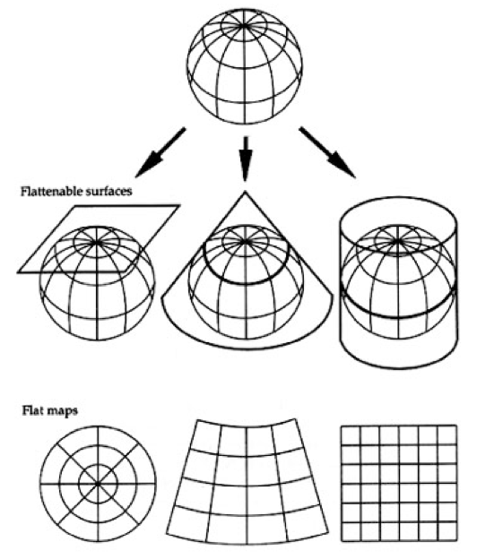</center>

Las distorsiones resultan en pérdidas de información que pueden ser en área, 
forma, distancia o dirección. Por ejemplo _Mercator_ preserva dirección y es 
útil para navegación: 

```{r, echo=FALSE}
detachAllPackages <- function() {

  basic.packages <- c("package:stats","package:graphics","package:grDevices","package:utils","package:datasets","package:methods","package:base")

  package.list <- search()[ifelse(unlist(gregexpr("package:",search()))==1,TRUE,FALSE)]

  package.list <- setdiff(package.list,basic.packages)

  if (length(package.list)>0)  for (package in package.list) detach(package, character.only=TRUE)

}

detachAllPackages()
```


```{r}
library(ggplot2)
states <- map_data("state")
usmap <- ggplot(states, aes(x=long, y=lat, group=group)) +
  geom_polygon(fill="white", colour="black")
usmap + coord_map("mercator")
```

Por su parte _Azimuthal Equal Area_ preserva area pero no dirección:

```{r}
usmap + coord_map("azequalarea")
```
<center>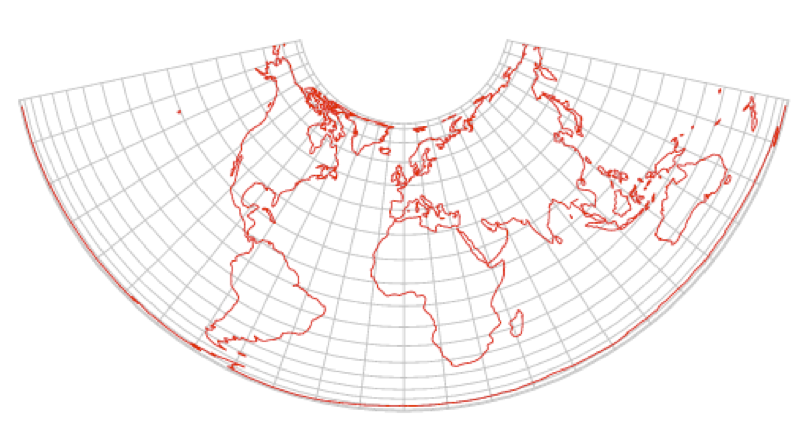</center>

En particular en investigación es común usar _Universal Transverse Mercator 
(UTM)_ porque preserva ángulos y dirección pero distorsiona distancia. Para
minimizar la distorsión se divide la Tierra en 60 regiones y utiliza una 
proyección (de secantes) en cada una.

<center>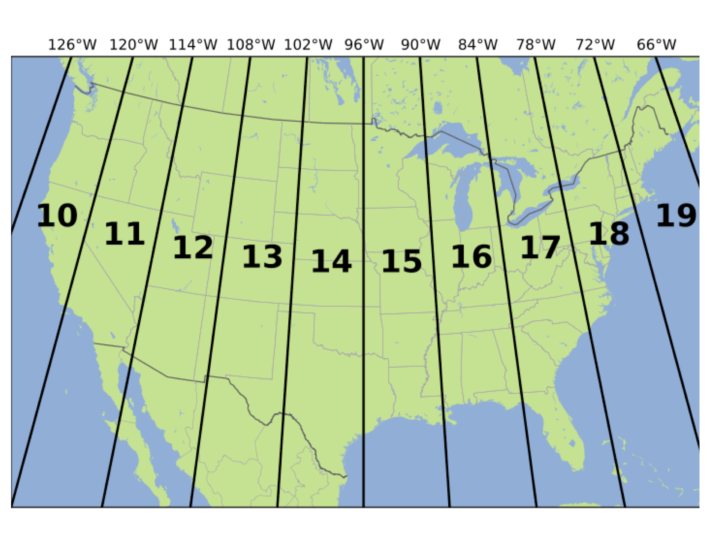</center>

En R podemos ver la lista de proyecciones con la siguiente instrucción:

```{r, message=FALSE, warning=FALSE}
library(rgdal)
# 135 proyecciones distintas
projInfo(type="proj")[1:20, ]
```

Es posible trabajar con datos no proyectados (longitud/latitud) pero se 
requieren métodos para medir distancias: gran círculo, naive euclideana, 
o cordal.

### Sistemas de referencia de coordenadas (CRS)

Los CRS nos dan una manera estándar de describir ubicaciones en la Tierra. Si 
combinamos información de distintos CRS debemos transformarlos para poder 
alinear la información.

En R, la notación que se utiliza para describir un CRS es proj4string de la 
libraría [PROJ.4](https://trac.osgeo.org/proj/) y se ven como:

+init=epsg:4121 +proj=longlat +ellps=GRS80 +datum=GGRS87 +no_defs +towgs84=-199.87,74.79,246.62

#### Shapefiles

Un _shapefile_ es un grupo de archivos que contienen geometrías e información de 
acuerdo a un estándar especificado por el Insituto de Investigación en Sistemas 
de Ecosistemas (ESRI). Nosotros tenemos los siguientes grupos de archivos 
(para países): 

* countries.shp: es el archivo principal y contiene la geometría correspondiente.

* countries.dbf: es la base de datos y almacena la información de los atributos de 
los objetos 

* countries.shx: almacena el índice de geometrías de los países.

* countries.prj (opcional): información del sistema de referencia de coordenadas.

Los shapefiles suelen tener asociada una proyección.

```{r}
ogrInfo(dsn = "./shps", layer = "municipio")
ogrInfo(dsn = "./shps", layer = "entidad")
```

En el caso de la proyección en los shapes de Municipios se usó
[North America Lambert Conformal Conic Projection](http://en.wikipedia.org/wiki/Lambert_conformal_conic_projection).

```{r}
mun_shp <- readOGR("shps" , "municipio")
mun_shp@proj4string
```

Veamos las librerías que usaremos

```{r, eval=FALSE, message=FALSE, warning=FALSE}
library(dplyr)
library(sp)
library(rgeos)
library(maptools)
library(rgdal)
library(ggmap)
library(gridExtra)
```

Usamos la función readOGR para leer los archivos de estados.

```{r, message=FALSE, warning=FALSE, comment=NA, results='hide'}
edo_shp <- readOGR("shps" , "entidad")
```

el "shps" indica que los archivos están en el directorio shps.

Notemos que el objeto edo_shp no es un data frame,

```{r}
class(edo_shp)
```

Lo podemos graficar directamente con plot.

```{r, eval=FALSE}
plot(edo_shp)
```

<center></center>


pero para poder graficarlo con ggplot debemos convertirlo en data frame.

Formamos el data frame (con fortify) que convierte los polígonos en 
puntos, les asigna el id (NOM\_ENT) correspondiente, y asigna también un 
_grupo_ que indica  a que polígono corresponde cada punto.

```{r}
edo_df <- fortify(edo_shp, region = "CVE_ENT")
class(edo_df)
head(edo_df)
```
Ya estamos listos para graficar, usaremos la geometría polígono utilizando la proyección de Mercator:

```{r, eval = FALSE}
ggplot(data = edo_df, aes(long, lat, group=group)) + 
  geom_polygon(colour='darkgrey', fill='white') +
  coord_map(projection="mercator") +
  theme_nothing()
```

```{r, echo = FALSE, eval = FALSE}
g <- ggplot(data = edo_df, aes(long, lat, group=group)) +
  geom_polygon(colour='darkgrey', fill='white') +
  coord_map(projection="mercator") +
  theme_nothing()
ggsave(filename = "figuras/mexico_mercator.png", plot = g, width = 10, height = 6)
```

<center>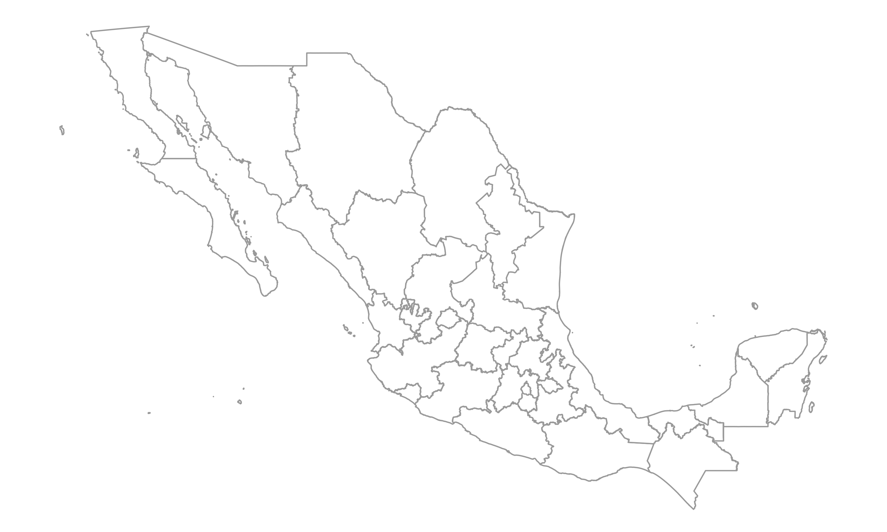</center>

Las proyecciones azimutales están centradas en el Polo Norte. Los paralelos son círculos concéntricos. Los meridianos son líneas radiales igualmente espaciadas.

Utilizando la proyección azimutal de áreas iguales:

```{r, eval=FALSE}
ggplot(data = edo_df, aes(long, lat, group=group)) +
  geom_polygon(colour='darkgrey', fill='white') +
  coord_map(projection="azequalarea") +
  theme_nothing()
```

```{r, echo=FALSE, eval = FALSE}
g <- ggplot(data = edo_df, aes(long, lat, group=group)) + 
  geom_polygon(colour='darkgrey', fill='white') +
  coord_map(projection="azequalarea") +
  theme_nothing()
ggsave(filename = "figuras/mexico_azimutal.png", plot = g, width = 10, height = 6)
```

<center>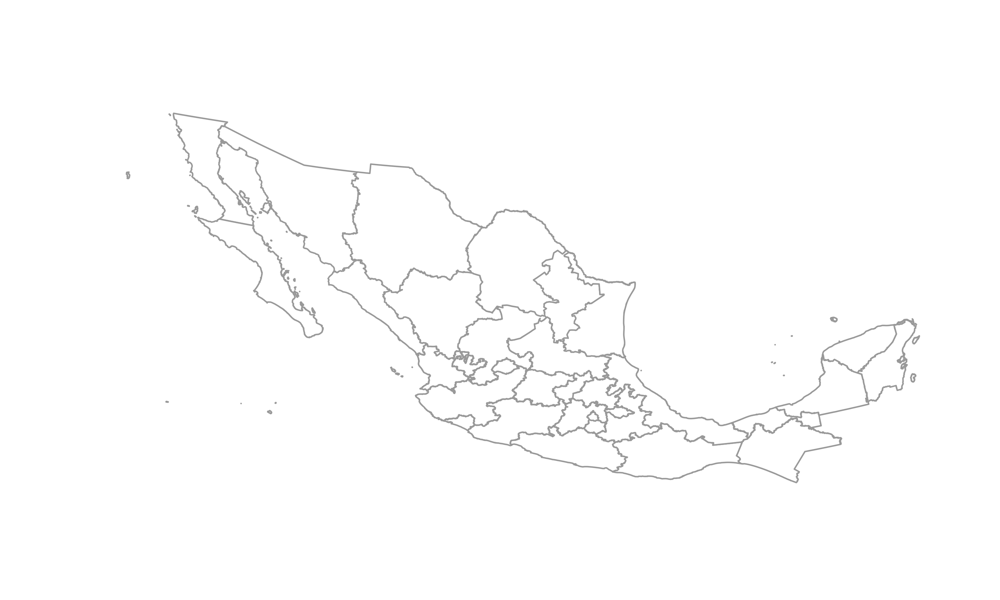</center>


#### Añadir variables al mapa

Nuestro objetivo final es hacer mapas para representar una variable. Veamos
cómo haríamos para representar el índice de carencias.

```{r}
library(readr)
indice <- read_csv("datos/indice_carencias_conapo_2010.csv")
```

**Filtramos** los datos para las entidades del centro del país:

```{r}
library(dplyr)
centro <- indice %>% 
  filter(NOM_ABR %in% c("DF", "Mex.", "Mor."))
```

Cargamos los datos de los polígonos a nivel municipio y convertimos a data frame utilizando `CVEGEO` como identificador de la región:

```{r}
mun_shp <- readOGR("shps", "municipio")
mun_df <- fortify(mun_shp, region = "CVEGEO")
```


Para incluirlas en el mapa añadimos las variables de interés a la base de datos
mun_df. Para este ejemplo graficaremos únicamente una región. Podemos crear
el subconjunto directamente del objeto _SpatialPolygonsDataFrame_ pero en 
este ejemplo filtraremos la base de datos _data.frame_.

```{r, message=FALSE, warning=FALSE}
mun_ind <- mun_df %>%
  mutate(CVE = id) %>%
  left_join(indice, by = "CVE") %>% 
  filter(NOM_ABR %in% c("DF", "Mex.", "Mor."))

ggplot() + 
  geom_polygon(data = mun_ind, aes(long, lat, group = group, fill = indice)) +
  labs(title = "Índice de carencias", fill = "Índice") +
  coord_fixed()
```

En el siguiente mapa los colores son a nivel municipio pero dibujamos las 
fronteras a nivel estado para evitar que los bordes opaquen los datos.

```{r, message=FALSE, warning=FALSE, eval=FALSE}
mun_ind <- mun_df %>%
  mutate(CVE = id) %>%
  left_join(indice, by = "CVE") 

library(ggmap)
library(scales)
ggplot() + 
  geom_polygon(data = mun_ind, aes(long, lat, group = group, fill = indice)) +
  geom_polygon(data = edo_df, aes(x = long, y = lat, group = group),
    fill = NA, color = "darkgray", size = 0.25) +
  labs(title = "Índice de carencias", fill = "Índice") +
  theme_nothing(legend = TRUE) + #fondo blanco
  guides(fill = guide_legend(reverse = TRUE)) +
  scale_fill_distiller(palette = "GnBu", breaks = pretty_breaks(n = 10)) + #paleta 
  coord_map()
```
<center>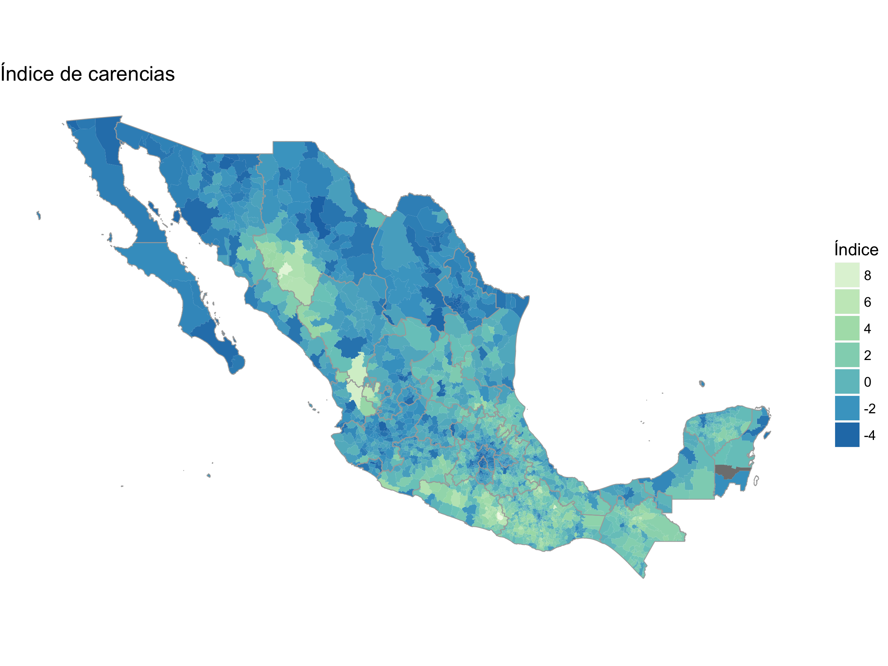</center>

### 6000 años de urbanización global desde 3700 aC hasta 2000 dC

En junio del 2016 se publicó un artículo en la revista Nature. Lo más interesante es que se trata del primer esfuerzo que se ha hecho en proporcionar datos completos del crecimiento de las ciudades del mundo desde el 3700 aC. Los autores (Meredith Reba, Femke Reitsma y Karen Seto) escriben en su artículo:

<p class="espacio">
</p>

<div style="text-align: center;">*¿Cómo se distribuyeron las ciudades a nivel mundial en el pasado? ¿Cuántas personas vivían en estas ciudades? Para entender la urbanización de hoy en día, debemos entender las tendencias históricas a largo plazo. Sin embargo, hasta la fecha no existe un registro exhaustivo de datos poblacionales espacialmente explícitos, históricos y urbanos a escala mundial. Aquí, desarrollamos el primer conjunto de datos de asentamientos urbanos entre 3700 aC y 2000 dC, mediante la digitalización, transcripción y geocodificación de datos históricos de poblaciones urbanas, datos arqueológicos y censales previamente publicadas por Chandler y Modelski.*</div>

<p class="espacio">
</p>

Para mayor información puedes visitar <http://www.nature.com/articles/sdata201634>.


Podemos utilizar estos datos para hacer una gráfica del crecimiento de las ciudades en cada siglo desde 3700 aC hasta el 2000 dC. En los datos cada unidad observacional consituye una ciudad en un año específico y las variables son el nombre de la ciudad, el país, su latitud y longitud, el año y la población.

Primero leemos los datos:

```{r, warning=FALSE}
library(tidyverse)
cities <- read_csv('datos/historical_population.csv')
```

Estos datos tienen un total de 1739 ciudades distintas. Es necesario cargar un mapa del mundo para representar la población de las ciudades sobre el mapa. Para esto se utilizan **shapefiles**.

Veamos cómo se cargan los datos para los mapas:

```{r, message=FALSE, comment=NA, results=FALSE}
library(rgdal)
wrld <- readOGR("shps", "countries")
```

el "shps" indica que los archivos están en el directorio `shps`.

Notemos que el objeto wrld no es un data frame,

```{r}
class(wrld)
```

Lo podemos graficar directamente con plot.

```{r}
plot(wrld)
```

Para poder graficarlo con **ggplot** debemos convertirlo en data frame.

Formamos el data frame (con fortify) que convierte los polígonos en 
puntos, les asigna el id (name) correspondiente al nombre de cada país, y asigna también un 
_grupo_ que indica a qué polígono corresponde cada punto.

```{r}
wrld_df <- fortify(wrld, region="name")
class(wrld_df)
head(wrld_df)
```

```{r, message=FALSE, warning=FALSE}
library(ggthemes)
base<- ggplot() + geom_map(data=wrld_df, map=wrld_df, aes(x=long, y=lat, map_id=id, group=group),fill="gray67") + theme_map()
```
Mostramos el mapa base:

```{r}
print(base)
```

Ahora es necesario trazar las ciudades en una capa superior al mapa con los círculos escalados por el tamaño de la ciudad.

Vamos a **filtrar** las ciudades correspondientes al año 2000 utilizando la función **filter()**:

```{r}
cities_2000 <- cities %>%
  filter(Year == 2000)
```

El data frame resultante consta de 1695 ciudades únicas y un total de 1825 observaciones:

```{r}
glimpse(cities_2000)
```


<br>

#### Pipeline


La idea de *pipeline* intenta hacer el desarrollo de código más fácil, en menor tiempo, fácil de leerlo, y por lo tanto, más fácil mantenerlo.

En el análisis de datos es común hacer varias operaciones y se vuelve difícil leer y entender el código. La dificultad radica en que usualmente los parámetros se asignan después del nombre de la función usando `()`. 

La forma en que esta idea logra hacer las cosas más faciles es con el operador **forward pipe** `%>%`que envía un valor a una expresión o función. Este cambio en el orden funciona como el parámetro que precede a la función es enviado ("piped") a la función. Es decir, supongamos `x` es una valor y  sea `f` una función, entonces **`x %>% f` es igual a `f(x)`.**


Por ejemplo, sea f(x) la función de probabilidad de la distribución normal con media $\mu = 0$ y desviación estándar $\sigma = 1$:
\[
f(x) = \frac{ 1 }{\sqrt{2\pi}} e^{- \frac{1}{2} x^2}
\]

```{r magrttrpipe}
f <- function(x){
  exp(-(x^2)/2)/sqrt(2*pi)
} 
# Con operador pipe
0 %>% f
```

que de forma tradicional se realiza:
```{r magrttr}
# Forma tradicional
f(0)
```

En resumen `%>%` funciona:

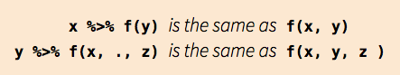

**Nota:** El shortcut del pipe `%>%` es command/ctrl + shift + m


> `Ejercicio`:
>
>
> ¿Qué hace el siguiente código? ¿Qué hace `.`?

```{r, eval = F}
df <- data_frame(
  x = runif(5),
  y = rnorm(5)
)
df %>% .$x
df %>% 
  ggplot(data = ., aes(x = x, y = y)) + 
    geom_point()
```


<br>

Regresando a la construcción de nuestro mapa de la población en el mundo, establecemos primero los puntos de corte y las etiquetas para el tamaño de los círculos:

```{r}
size_breaks<-c(10000,50000,100000,500000,1000000,5000000,10000000)
labs_breaks <- c("10K","50k","100K","500k","1M","5M","10M+")
```

Tanto `size_breaks` como `labs_breaks` son vectores que se van a utilizar para definir la escala (tamaño) de los círculos de acuerdo a la densidad poblacional de cada ciudad.


Ahora graficamos agregando una capa de puntos a la gráfica base que teníamos anteriormente:

```{r}
base +
  geom_point(data=cities_2000, aes(x=Longitude, y=Latitude, size=Pop), 
             colour="darkmagenta",alpha=0.3, pch=20) +
    scale_size(breaks=size_breaks,range=c(2,14), 
               limits=c(min(cities_2000$Pop),max(cities_2000$Pop)),
               labels=c("10K","50k","100K","500k","1M","5M","10M+")) +
    coord_map("mollweide", ylim=c(-55,80),xlim=c(-180,180))
```

Se puede producir una gráfica para cada siglo y crear un gif con las gráficas resultantes:

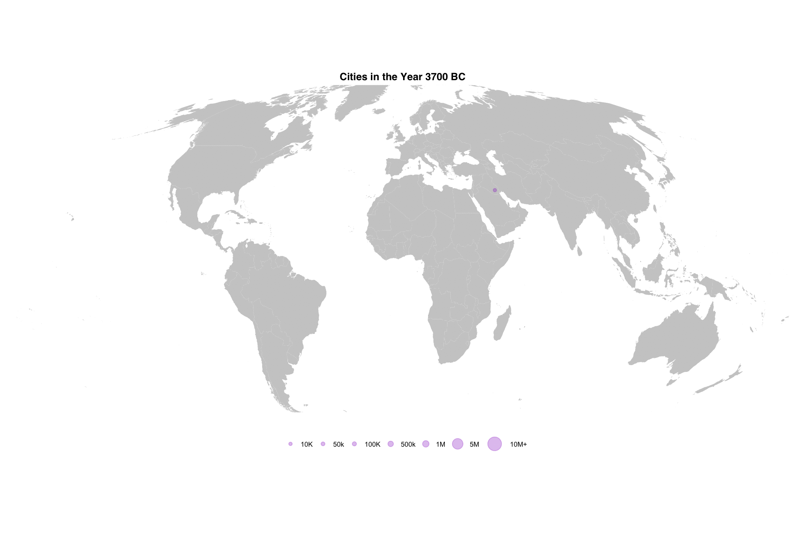

### Otros ejemplos


<!-- #### Ejemplo con leaflet -->
```{r, message=FALSE, warning=FALSE, echo=FALSE, eval=FALSE}
#devtools::install_github('rstudio/leaflet')
library(leaflet)
library(maps)
library(rgdal)
library(RColorBrewer)

# Read data
url.d <- 'https://ourworldindata.org/wp-content/uploads/datamaps/AgeOfDemocracies2007/AgeOfDemocracies2007.csv'
df.democracies <- read_csv(url.d, col_types = 'ci')

# Read map
# "http://www.naturalearthdata.com/http//www.naturalearthdata.com/download/50m/cultural/ne_50m_admin_0_countries.zip"
countries <- readOGR(dsn = "shps", 
                     layer = "ne_50m_admin_0_countries", 
                     encoding = "UTF-8",
                     verbose = FALSE)

# Merge shapefile and data
leafmap <- merge(countries, 
                 df.democracies, 
                 by.x = "ISO_A3", 
                 by.y = "ISO",                    
                 sort = FALSE)
# Remove NA's
leafmap <- leafmap[!is.na(leafmap@data$Democduration) ,]

# Leaflet
popup_dat <- paste0("<strong>País: </strong>", 
                    leafmap$NAME, 
                    "<br><strong>Valor democrático: </strong>", 
                    leafmap$Democduration)
pal <- colorBin(
  palette = "BuPu",
  domain = leafmap$Democduration, 9, pretty=FALSE)

leaflet(data = leafmap) %>%
  addProviderTiles("MapBox", options=providerTileOptions(id = "mapbox.light",accessToken="")) %>%
  #setView(0, 0, zoom = 2) %>%
  addPolygons(fillColor = ~pal(leafmap[['Democduration']]), 
              fillOpacity = 0.8, 
              smoothFactor = 0.1, 
              color = "white",
              weight = 0.5,
              popup = popup_dat)
```


#### Narrativa gráfica de espacio y tiempo

Regresemos a la gráfica de Minard:


<p class="espacio">
</p>

Una manera efectiva de capturar mayor poder en la información que transmite una serie de tiempo es agregando dimensiones espaciales al diseño de la gráfica. La gráfica de Minard, como la describe E.J. Marey, parece "desafiar la pluma del historiador con su brutal elocuencia", la combinación de datos del mapa, y la serie de tiempo, dibujados en 1869, "retratan una secuencia de pérdidas devastadoras que sufrieron las tropas de Napoleón en 1812". Comienza en la izquierda, en la frontera de Polonia y Rusia, cerca del río Niemen. La línea gruesa dorada muestra el tamaño de la Gran Armada (422,000) en el momento en que invadía Rusia en junio de 1812. 

El ancho de esta banda indica el tamaño de la armada en cada punto del mapa. En septiembre, la armada llegó a Moscú, que ya había sido saqueada y dejada desértica, con sólo 100,000 hombres. 

El camino del retiro de Napoleón desde Moscú está representado por la línea oscuara (gris) que está en la parte inferior, que está relacionada a su vez con la temperatura y las fechas en el diagrama de abajo. Fue un invierno muy frío, y muchos se congelaron en su salida de Rusia. Como se muestra en el mapa, cruzar el río Berezina fue un desastre, y el ejército de Napoleón logró regresar a Polonia con tan sólo 10,000 hombres. 

También se muestran los movimientos de las tropas auxiliaries, que buscaban proteger por atrás y por la delantera mientras la armada avanzaba hacia Moscú. La gráfica de Minard cuenta una historia rica y cohesiva, coherente con datos multivariados y con los hechos históricos, y que puede ser más ilustrativa que tan sólo representar un número rebotando a lo largo del tiempo.

Quizás sea la mejor gráfica estadística que jamás se haya elaborado.

<p class="espacio">
</p>

Para comenzar a hacer nuestra gráfica, primero es necesario **importar** los datos:
```{r, message=FALSE, warning=FALSE}
troops <- read_csv(file = 'datos/troops.csv')
cities <- read_csv(file = 'datos/cities.csv')
temps <- read_csv(file = 'datos/temps.csv')
```


<p class="espacio">
</p>

Veamos cómo es la información que se tiene en `troops`:

```{r, message=FALSE, warning=FALSE}
glimpse(troops)
```

<p class="espacio">
</p>

Y la tabla de temperaturas, `temps`, tiene la siguiente estructura:

```{r, message=FALSE, warning=FALSE}
glimpse(temps)
```

<p class="espacio">
</p>

Comenzamos viendo cómo graficar el diagrama de la parte inferior de la gráfica de Minard:

<p class="espacio">
</p>

```{r, fig.height=3, fig.width=10, message=FALSE, warning=FALSE}
ggplot(data = temps, mapping = aes(x = long, y = temp)) +
  geom_line() +
  geom_text(mapping = aes(label = paste(day,month)), hjust = 0.1, vjust = 1.5) +
  scale_x_continuous(limits = c(24, 39)) +
  scale_y_continuous(limits = c(-35,0),breaks = c(-30,-20,-10,0))
```


<p class="espacio">
</p>

Luego hacemos la gráfica del camino del ejército:


```{r, fig.height=5, fig.width=10, message=FALSE, warning=FALSE}
ggplot(cities, aes(x = long, y = lat)) +
  geom_path(data=troops,aes(size = survivors, colour = direction, group = group)) +
  geom_point() +
  geom_text(aes(label = city), hjust=0, vjust=1, size=3) +
  scale_colour_manual(values = c("bisque2","grey50")) +
  scale_x_continuous(limits = c(24, 39))
```

<p class="espacio">
</p>


Se puede hacer una gráfica como la que se muestra a continuación:

```{r, fig.height=6.5, fig.width=10, comment = NA, message=FALSE, warning=FALSE}
library(tidyverse)
library(ggmap)
library(rgdal)
library(scales)
library(gridExtra)
library(gtable)
library(grid)

theme_minard <- theme(
    panel.background = element_rect(fill="white"),
    panel.border = element_blank(),
    legend.key = element_rect(fill="white"),
    legend.key.size = unit(3, "line"),
    axis.text.y = element_text(colour="black"),
    axis.text.x = element_text(colour="black"),
    text = element_text(size=12, family="Times")
    )

p1 <- ggmap(read_rds("datos/sq_map.rds")) +
  geom_path(data = troops,
            mapping = aes(x = long, y = lat, size = survivors,
                          color = direction, group = group),
	          lineend = "square", linejoin = "bevel") +
  geom_text(data = cities, mapping = aes(x = long, y = lat, label = city),
            size = 3, color = "black", family="Times", fontface="italic",
            hjust=0, vjust=-1) +
  geom_point(data = cities,
             mapping = aes(x = long, y = lat), colour = "black", size=3) +
  coord_map(xlim = c(22.6,38.4), ylim = c(53.93,55.97)) +
  xlab(NULL) + ylab("Latitude") +
  scale_size(range = c(1, 12),
                  breaks = c(90000, 50000, 10000, 4000),
                  labels = c(90000, 50000, 10000, 4000)) +
  scale_colour_manual(values = c("bisque2", "grey50")) +
  theme_minard +
  scale_x_continuous(breaks = c(25,30,35)) +
  theme(legend.position = "top")


p2 <- ggplot(data = temps, mapping = aes(x = long, y = temp)) +
  geom_line() +
  geom_text(aes(label = paste(day,month)), size = 3, family="Times",
            fontface="italic",  hjust = 0.1, vjust=1.5) +
  theme_minard +
  theme(panel.grid.major = element_line(size=.2,colour="black")) +
  xlab("Longitude") + ylab("Température") +
  scale_x_continuous(limits = c(23.4, 37.6), breaks = c(25,30,35)) +
  scale_y_continuous(limits = c(-35,0),breaks = c(-30,-20,-10,0))

grid.arrange(p1, p2, widths = c(10), heights = c(6,1.5), ncol = 1)
```

#### El Siglo XVIII
Éste es un ejemplo más complejo que muestra cómo producir un mapa de los flujos de transporte del siglo XVIII. Los datos se obtuvieron del proyecto CLIWOC y representan una muestra de registros de barcos. Estamos usando una muestra muy pequeña. El ejemplo se ha elegido para demostrar una gama de capacidades dentro de ggplot2 y las formas en que pueden aplicarse para producir mapas de alta calidad con sólo unas pocas líneas de código.

Para mayor información puedes visitar <http://pendientedemigracion.ucm.es/info/cliwoc/>. El análisis original se encuentra en Brunsdon (2015).

Si nos fijamos en las primeras líneas de bdata vemos que hay 7 variables por cada observación que representa un solo punto en el curso de los barcos. También se incluyen el año del viaje y la nacionalidad del barco. Las 3 últimas columnas son identificadores que se utilizan más adelante para agrupar los puntos de coordenadas en las rutas.

Primero leemos los datos:

```{r, message=F, results='hide', comment=NA}
library(tidyverse)
library(rgdal)
library(png)

wrld <- readOGR("shps", "countries")
btitle <- readPNG("figuras/brit_titles.png")
compass <- readPNG("figuras/windrose.png")
bdata <- read.csv("datos/british_shipping_example.csv")
```

Se sugiere ejecutar estas líneas en un script de R en RStudio y ver los datos haciendo click en el nombre de la base de datos `bdata` en la ventana de Environment.


Primero visualizamos el mapa:
```{r}
wrld.f <- fortify(wrld, region="sov_a3")
ggplot(wrld.f, aes(x = long, y = lat)) +
  geom_polygon(aes(group=group),size = 0.1,colour="black",fill="wheat",data=wrld.f,alpha=1)
```

El código cortado a continuación crea la capa de parcela que contiene las rutas de envío. La función `geom_path()` se utiliza para poner en otra capa las coordenadas en las rutas. Dentro de la función de mapeo `aes()` que hemos especificado long y lat, pero es necesario agrupar por las variables `trp` y `group.regroup` para identificar las rutas únicas.

```{r}
ggplot(wrld.f, aes(x = long, y = lat)) +
  geom_polygon(aes(group=group),size = 0.1,colour="black",fill="wheat",data=wrld.f,alpha=1)+
  geom_path(aes(group = paste(bdata$trp, bdata$group.regroup, sep = ".")), 
            color="darkblue", size = 0.2, data= bdata, alpha = 0.5, lineend = "round")
```


Con las siguientes capas lo que se busca es **literalmente adornar** el mapa, poniendo de fondo el color azul mar (lightblue). Por otro lado, la función `annotation_raster()` traza sobre el mapa los adornos de las imágenes cargadas anteriormente. Esto requiere que se especifique el cuadro delimitador de cada imagen. En este caso usamos la latitud y la longitud (en WGS84) y podemos usar estos parámetros para cambiar la posición de la imagen y también su tamaño. La última función `coord_equal()` fijan la relación de aspecto de la gráfica entre las coordenadas de longitud y latitud para que el mapa se vea correctamente.


```{r}
ggplot(wrld.f, aes(x = long, y = lat)) +
  geom_polygon(aes(group=group),size = 0.1,colour="black",fill="wheat",data=wrld.f,alpha=1)+
  geom_path(aes(group = paste(bdata$trp, bdata$group.regroup, sep = ".")), 
            color="darkblue", size = 0.2, data= bdata, alpha = 0.5, lineend = "round") +
  theme(panel.background = element_rect(fill='lightblue',colour='black')) + 
  annotation_raster(btitle, xmin = 30, xmax = 140, ymin = 51, ymax = 87) + 
  annotation_raster(compass, xmin = 65, xmax = 105, ymin = 25, ymax = 65) + 
  coord_equal()
```

Se puede quitar los ejes $x$ y $y$ de la gráfca para obtener un resultado como el que se muestra a continuación:

```{r}
xquiet <- scale_x_continuous("", breaks=NULL)
yquiet <- scale_y_continuous("", breaks=NULL)
quiet <- list(xquiet, yquiet)
base <- ggplot(wrld.f, aes(x = long, y = lat))
wrld <- c(geom_polygon(aes(group=group), size = 0.1, colour= "black", fill="wheat", data=wrld.f, alpha=1))
route <- c(geom_path(aes(long,lat,group = paste(bdata$trp, bdata$group.regroup, sep = ".")), colour="#0F3B5F", size = 0.2, data= bdata, alpha = 0.5, lineend = "round"))
base + route + wrld + theme(panel.background = element_rect(fill='#BAC4B9',colour='black')) +
  annotation_raster(btitle, xmin = 30, xmax = 140, ymin = 51, ymax = 87) +
  annotation_raster(compass, xmin = 65, xmax = 105, ymin = 25, ymax = 65) +
  coord_equal() +
  quiet
```

<p class="espacio">
</p>

<p class="espacio">
</p>

<p class="espacio">
</p>


> Las notas de este taller introductorio están basadas en el material de Teresa Ortiz Mancera, el libro “R for Data Science” escrito por Hadley Wickham y el libro "Data Visualization for Social Science" de Kieran Healy.


# Referencias

[1] Newman, G. E., & Scholl, B. J. (2012). Bar graphs depicting averages are perceptually misinterpreted: The within-the-bar bias. Psychonomic bulletin & review, 19(4), 601-607.

[2] Tufte, E. R. (2006). Beautiful Evidence. New York.

[3] Healy, K., & Moody, J. (2014). Data visualization in sociology. Annual review of sociology, 40, 105-128.

[4] Ortiz Mancera, M. T. (2017). R para análisis de datos. Recuperado en línea: https://tereom.github.io/tutoriales/R_intro_visualizacion.html

[5] Keane, J. (2016). Introduction to Data Visualization. Recuperado en línea: https://github.com/jonkeane/data-visualization-intro/blob/master/slides/dataviz.rst

[6] Tufte, E. R. (2001). The visual display of quantitative information.

[7] Jackman, R. W. (1980). The impact of outliers on income inequality. American Sociological Review, 45(2), 344-347.

[8] Hewitt, C. (1977). The effect of political democracy and social democracy on equality in industrial societies: A cross-national comparison. American sociological review, 450-464.

[9] Vanhove, Jan. 2016. “What Data Patterns Can Lie Behind a Correlation Coefficient?”

[10] Qiu, L. (2015, Octubre 1). Chart shown at Planned Parenthood hearing is misleading and 'ethically wrong'. PolitiFact. Recuperado en línea: http://www.politifact.com/truth-o-meter/statements/2015/oct/01/jason-chaffetz/chart-shown-planned-parenthood-hearing-misleading-/

[11] Yanofsky, D. (2013, Septiembre 10) The chart Tim Cook doesn’t want you to see. Quartz. Recuperado en línea: https://qz.com/122921/the-chart-tim-cook-doesnt-want-you-to-see/

[12] Engel, P. (2014, February 18). This Chart Shows An Alarming Rise In Florida Gun Deaths After 'Stand Your Ground' Was... Recuperado en línea: http://www.businessinsider.com/gun-deaths-in-florida-increased-with-stand-your-ground-2014-2 

[13] Dykes, M. (2016, Octubre 23). Why Have There Been More Mass Shootings Under Obama than the Four Previous Presidents Combined? Recuperado en línea: http://truthstreammedia.com/2015/12/02/why-have-there-been-more-mass-shootings-under-obama-than-the-four-previous-presidents-combined/ 

[14] Fung, K. (2015). Junk Charts Trifecta Checkup: The Definitive Guide. Recuperado en línea: http://junkcharts.typepad.com/junk_charts/junk-charts-trifecta-checkup-the-definitive-guide.html 

[15] Willam S. Cleveland. (1994). Visualizing Data, Hobart Press.

[16] Hyndman y Fan. (1996). Sample quantiles in statistical packages, The American
Statistician.

[17] B.D. Ripley. (2004). Robust Statistics.

[18] David W. Scott. (1992) Multivariate Density Estimation, Wiley & Sons.

[19] John W. Tukey y Frederick Mosteller (1977). Data Analysis and Regression,
Addison-Wesley.

[20] Izenman y Sommer. (1998). Philatelic mixtures and multimodal densities, Journal of the
American Statistical Association.

[21] Wickham, H., & Grolemund, G. (2016). R for data science.

[22] Brunsdon, C., & Singleton, A. (2015). Geocomputation: A Practical Primer. SAGE.

[23] Cleveland, William S., and Robert McGill. (1984). “Graphical Perception: Theory, Experimentation, and Application to the Development of Graphical Methods.” Journal of the American Statistical Association 79: 531–34.

[24] Cleveland, William S., and Robert McGill. (1987). “Graphical Perception: The Visual Decoding of Quantitative Information on Graphical Displays of Data.” Journal of the Royal Statistical Society Series A 150: 192–229.

[25] Heer, Jeffrey, and Michael Bostock. (2010). “Crowdsourcing Graphical Perception: Using Mechanical Turk to Assess Visualization Design.” In Proceedings of the Sigchi Conference on Human Factors in Computing Systems, CHI ’10, New York, NY, USA: ACM, 203–12. http://doi.acm.org/10.1145/1753326.1753357.

[26] Tufte, E. R. (1990). Envisioning information. Graphics press.
